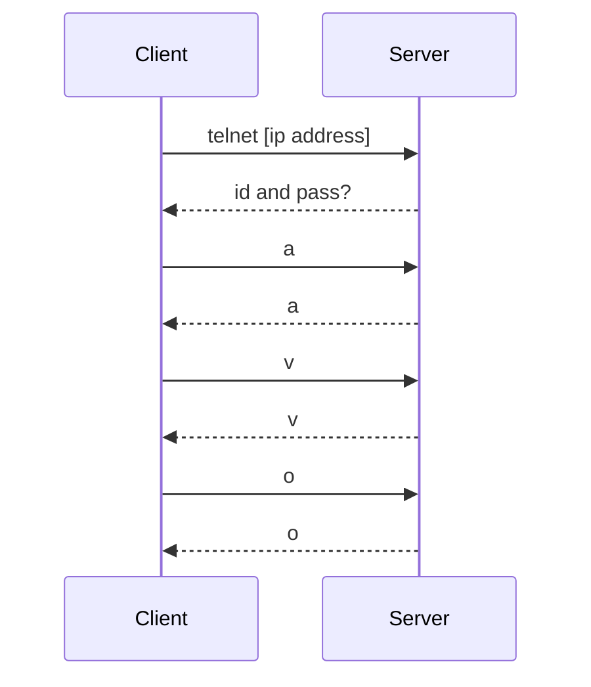

---
aliases:
  - May 2023
tags:
  - PYQ
  - Data-Communication-and-Networking
Creation Date: 2024-05-22T13:26:00
Completion: true
obsidianUIMode: preview
---
# Section A
## Question 1
### (a)
No. This is because PC1 is not connected to any DNS server. The website URL cannot be translated into ip address. The pc is unable to retrieve the ip address of the website URL.
### (b)
Check the network connectivity. Ensure that the wire connection of the pc to the switch is not loose. Also make sure that the connection of the switch to both DNS server and Webserver is stable. 
### (c)
/32 - /24 = 8
2^8 - 2 = 254 hosts
254 - 5 = 249
There are 249 additional hosts that can be added to this network
### (d)
192.168.3.100
### (e)
![[DHCP flow|500]]
#### Discovery packet
When a **new device** is connected to a network, it broadcasts DHCP discovery packet to all the connected devices in the local subnet. The DHCP discovery packet contains the request for configuration parameters.
**Source IP:** 0.0.0.0
**Destination IP:** 255.255.255.255
#### Offer packet
The DHCP server receives the DHCP discovery packet and replies with a DHCP offer packet that contains the ip address and other parameters to the client.
**Source IP:** 1.1.1.1
**Destination IP:** 255.255.255.255
#### Request packet
The DHCP server receives the DHCP offer packet and sends a DHCP request packet, requesting the ip address and other parameters to be assigned to it. 
**Source IP:** 0.0.0.0
**Destination IP:** 255.255.255.255
#### Acknowledge packet
The DHCP server receives the request packet and sends a DHCP acknowledge packet, confirming the assignment of the ip address and other configurations to the client device. 
**Source IP:** 1.1.1.1
**Destination IP:** 255.255.255.255

## Question 2
### (a)
Two benefits of VLANS
1. It is cheaper than physical LANs
	- This is because one switch can have multiple networks
	- In physical LANs, one switch can only one network. 
	- This makes the cost of building multiple LANs more expensive
2. Have VLAN spanning
	- VLAN can expand its area by connecting different switches
	- This allows users who want to be on the same network to be in different physical location as compared to physical LANs
	- As long as the VLAN has the same id, the devices can communicate with each other even if the connected switched are different
3. Better security compared to physical LANs
	- VLAN reduces the risk of broadcast storm attack
	- [!] Broadcast storm attack is when hackers spam packets into a network until it overwhelms the network devices causing them to be congested, buffered and crashed.
	- Minimising the broadcast domain will reduce the number of hosts affected 
### (b)
Neither device to offer an IP address to PC2. This is because the servers are located in different networks. DHCP server 1 and DHCP server 2 are in VLAN3 but the pc is in VLAN4. The DHCP discovery packets are only sent to the devices in a local subnet. 
### (c)
PC1 will receive two DHCP OFFER packets. Both DHCP servers will receive the DHCP DISCOVER PACKET. Each DHCP server will send separate DHCP offer packet to PC1. PC1 then chooses one of the offered ip addresses and reply with a DHCP request packet to the selected DHCP server. The selected DHCP server then replies with a DHCP Acknowledgement packet to confirm the assignment of the ip address. The other DHCP server does not receive any request packet from PC1
### (d)
config t
int fa0/3
no shut
int fa0/3.3 
encap dot1q 3
ip address 10.10.10.254 255.255.255.0
exit
### (e)
The DHCP servers work independently of each other; one server does not know the assignment of ip addresses by another server When a new device enters, both DHCP servers will send a DHCP offer packet. Because they have the same ip address pool, there is a chance that the ip address offered has already been assigned by another DHCP server.
## Question 3
### (a)
#### Router_Amazon
config t
ip route 0.0.0.0 0.0.0.0 192.168.4.2
#### Router_Apple
config t
ip route 0.0.0.0 0.0.0.0 192.168.1.2
#### Router_Google
config t
ip route 0.0.0.0 0.0.0.0 192.168.2.2
#### Router_IBM
config t
ip route 0.0.0.0 0.0.0.0 192.168.3.2

### (b)
config t
router rip
network 192.168.1.0
network 192.168.4.0
show ip route

### (c)
Static route. Static route has the lowest admin distance. It also has the least hop count. Static route has the highest precedence.

### (d)
2 routers. Router0 is directly connected to router with ip address of 200.200.100.1. The second router would have to connect to another router to reach the destination network 192.168.2.0/24. 
### (e)
Load balancing if two routes reaches the same destination and as a last resort if the routing path is not available in the routing table

# Section B
## Question 4
![[Packet Header.png]]
### (a) 
$5\times20$=20
### (b)
12 bytes
### (c)
5  
### (d)
no. There last flag bit is 0. This means that the packet is the last fragment and no other frags are coming.
### (e)
Yes. The packet can be sent successfully to the destination host. This is because both destination and source host belong to the same LAN. The two computers communicate using local addressing and MAC address. Default gateway is needed only for communication between devices from different networks. 
### (f)
To do this question, convert the data into binary. If it is longer than 16 bits, divide them into chunks of 16 bits. Add these chunks together. If there is a carry over, add 1. Find the 1's complement (Invert the values) to find the checksum.  If it is all 1, there is no error. If there is a 0, there is an error in the packet. 
**Sender's end**
**Data**
0x3eaa -> 0011 1110 1010 1010
**Checksum**
0x1989 -> 0001 1001 1000 1001
0x189a -> 0001 1000 1001 1010
**Invert Data**
1100 0001 0101 0101
0001 1000 1001 1010
1101 1001 1110 111
**Add checksum**
1100 0001 0101 0101
0001 1001 1000 1001
1101 1010 1101 1110 
There is an error in the transmission

The data will have an error. The checksum in the sender is 0x189a. The checksum in the receiver and sender are different. 
### (g)
TCP provides extensive error checking and acknowledgement of the data but UDP only has basic error checking with checksum. TCP guarantees the delivery of the data but UDP does not guarantee the delivery of the data. 

## Question 5

### (a)
1. 500
2. 10 000
3. 600
4. 500
### (b)

### (c)
SSH encrypts the data packets sent from client to the server compared to TELNET that sends data in plaintext. This reduces the risk of man in the middle attack. The interceptor cannot decrypt to determine the actual content of the data. SSH also establishes a encrypted network connection between the client and the server. The user also has to authenticate using username and password along with private key or public key. 

### (d)
A hub is added between switch1 and the end node. The hub will act as an amplifier. The signal remains strong until it reaches the end node. A hub is cheaper than switches and routers. 

 # September 2021
 [[Past Year Papers/Year 1/Semester 1/Data Communication and Networking/September 2021|September 2021]]
