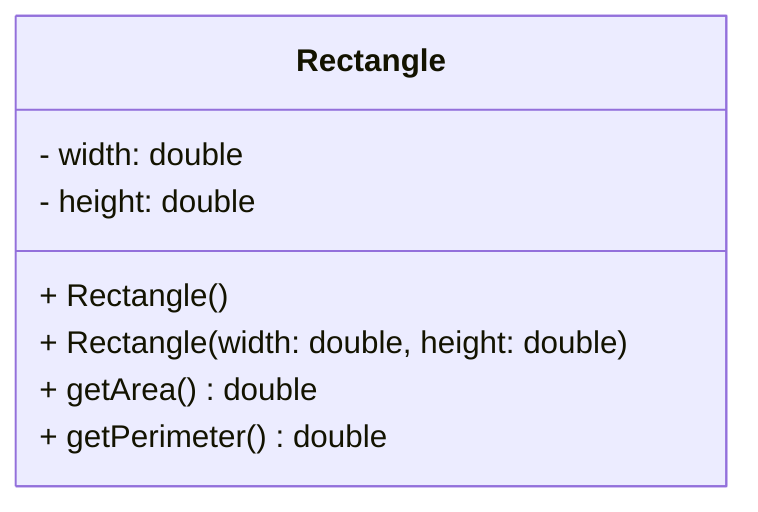
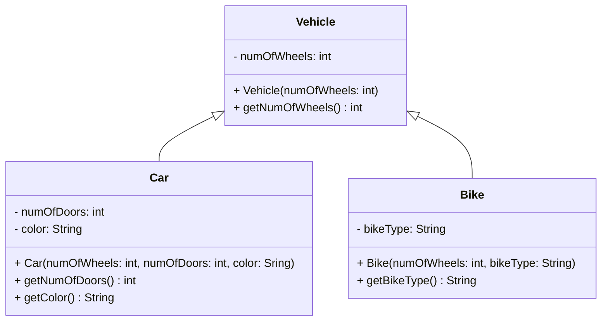

---
aliases:
  - May 2023
tags:
  - PYQ
  - Java
Creation Date: 2024-09-18T14:12:00
Finished Date: 2024-09-18
Completion: true
obsidianUIMode: preview
---
# Section A
## Question 1
### Question A
#### Question I
1. `start()`
	1. Called when the application is automatically launched
2. `launch()/init()`
	1. Called before the `start()` method is called to initialise resources or perform tasks before loading the application's main UI
3. `stop()`
	1. Called when the application shuts down
	2. Allows the application to perform clean up or save state before exiting
	3. Called when the user closes the application window or when `Platform.exit()` is called
#### Question II
The `Application` class must be extended. The library is imported like this, `import java.application.Application`  The `start` method must be overridden
#### Question III
```run-java
// Inner class way
class Green implements EventHandler<ActionEvent>{
	public void handle(ActionEvent e){
		rec.setFill(Color.GREEN)
	}
}

// Anonymous class way
btn.setOnAction(new EventHandler<ActionEvent>(){
	@Override
	public void handle(ActionEvent event){
		rec.setFill(Color.GREEN);
	}
});
```
```run-java
// lambda way
btn.setOnAction(e->rec.setFill(Color.GREEN));
```
### Question B
```run-java
public void start(Stage primaryStage){
	Button vegies = new Button("Vegies");
	Button beans = new Button("Beans");
	Button rice = new Button("Rice");
	Button beer = new Button("Beer");
	TextArea text = new TextArea("This is a text area");
	
	HBox hBox = new HBox();
	hBox.setAlignment(Pos.CENTER)
	hBox.getChildren().addAll(vegies, beans, rice, beer);
	hBox.setPadding(new Insets(10));
	
	VBox root = new VBox();
	root.getChildren().addAll(text, hBox);
	root.setPadding(new Insets(10));
	Scene scene = new Scene(root, 300, 200);
	
	primaryStage.setScene(scene);
	primaryStage.setTitle("JavaFX");
	primaryStage.show();
}
```
### Question C
```java
public class Rotate_Test extends Application{
	public void start(Stage primaryStage){
		StackPane pane = new StackPane();
		
		Rectangle rect = new Rectangle(150,50);
		rect.setStroke(Color.RED);
		rect.setFill(Color.WHITE);
		pane.getChildren().add(rect);
		
		HBox hBox = new HBox();
		hBox.setSpacing(10);
		hBox.setAlignment(Pos.CENTER);
		
		Button btPos = new Button("+Clockwise");
		Button btNeg = new Button("-Clockwise");
		
		hBox.getChildren().addAll(btPos, btNeg);
		
		btPos.setOnAction(e->
			rect.setRotate(rect.getRotate() +10 )
		);
		btNeg.setOnAction(e->
			rect.setRotate(rect.getRotate() - 10 )
		); 
		
		BorderPane borderPane = new BorderPane();
		borderPane.setCenter(pane);
		borderPane.setPadding(new Insets(10));
		borderPane.setBottom(hBox);
		BorderPane.setAlignment(hBox, Pos.CENTER);
		
		Scene scene = new Scene(borderPane, 300, 250);
		primaryStage.setScene(scene);
		primaryStage.setTitle("Spin");
		primaryStage.show();
	}
	public static void main(String[] args){
		launch(args);
	}
}
```
## Question 2
### Question A
#### Question I
InputStream is used to read from a source and OutputStream is used to write into a source.
#### Question II
```java
public class Main{
	public static void main(String[] args) throws IOException{
		final String FILENAME = "receipt.txt";
		String itemID;
		String category;
		double price;
		int units;
		String dump;
		double totalPrice= 0;
		// ouput the TOTAL price of all ELECTRONICS ITEMS
		File file = new File(FILENAME);
		Scanner instream = new Scanner(file);
		while(instream.hasNext()){
			itemID = instream.next();
			category = instream.next();
			if (category.equals("Electronics"))
				totalPrice += (instream.nextDouble()) * (instream.nextInt());
			else
				dump = instream.nextLine();
		}
		System.out.printf("%.2f%n", totalPrice);
		instream.close();
	}
}
```
### Question B
#### Question I
Programs can execute SQL statements, retrieve results, and present data in user-friendly interface.
#### Question II
```run-java
import java.sql.*;

public class Main{
	public static void main(String[] args) throws SQLException, ClassNotFoundException{
		String databasePath = "jdbc:ucanaccess://" + System.getProperty("user.dir").replace("\\", "/") + "/DatabaseLab.accdb";
		Connection conn = DriverManager.getConnection(databasePath);
		if (conn != null)
			System.out.println("Successfully connected to database");
		st.executeUpdate("CREATE TABLE Employee(
			id int(3),
			name varchar(25),
			designation varchar(15),
			department(10),
			primary key (id)
		)");
		st.executeUpdate("INSERT INTO Employee VALUES(122, 'David', 'Engineer', 'Safety')");
		st.executeUpdate("INSERT INTO Employee VALUES(132, 'John', 'Clerk', 'HR')");
		st.executeUpdate("INSERT INTO Employee VALUES(143, 'James', 'Operator', 'QC')");
		ResultSet rs = st.executeQuery("SELECT * FROM Employee");
		if (rs != null){
			System.out.println("Table creation process successfully!\n");
			while(rs.next()){
				for(int index = 1; index <= 3; index++){
					System.out.printf("%s\t", rs.getString(index));
				}
			}
		}
	}
}
```
## Question 3
### Question A
Use the `throws` keyword to the methods that may cause exception. This indicates the method may fire exception. Inside the method, if the condition is met, `throw` keyword is used to fire the exception.

```run-java
public int method(int x, int y) throws ArithmeticException{
	if ( y == 0)
		throw new Exception("Division by 0 error!");
	return (x/y);
}
```

A `try-catch` block is used to handle the exception in a program. The statements that may cause exceptions in placed in the `try` block. In the `catch` block, the type of exception is specified and the statements to handle the exception is placed there.

```run-java
int numerator = 5;
int denominator = 0;
try{
	System.out.println(method(1,0));
}catch(ArithmeticException e){
	System.out.println(e);
	e.getMessage();
}
```
### Question B
throws is on a method to indicate that the method may fire an exception may while throw is used when to fire the exception if the condition is met.
### Question C
```java
public class Question3c{
	public static void main(String[] args){
		try{
			String s = "50";
			int a = Integer.parseInt(s);
			int b = a/2;
			System.out.println("The value of b is " + b);
			System.out.println("Try block is finished");
		}
		catch(Exception ex){
			Sytem.out.println("NumberFormatException");
		}
		catch(RuntimeException ex){
			System.out.println("NumberFormatException");
		}
		finally{
			System.out.println("The finally clause is executed");
		}
	}
}
```
#### Question I
The order of the exception.
>[!FYI]
>Since `Exception` is the parent of `RuntimeException`, any `RuntimeException` would be caught by `Exception`, making `RuntimeException` redundant.
#### Question II
```java
public class Question3c{
	public static void main(String[] args){
		try{
			String s = "50";
			int a = Integer.parseInt(s);
			int b = a/2;
			System.out.println("The value of b is " + b);
			System.out.println("Try block is finished");
		}
		catch(RuntimeException ex){
			System.out.println("NumberFormatException");
		}
		catch(Exception ex){
			Sytem.out.println("NumberFormatException");
		}
		finally{
			System.out.println("The finally clause is executed");
		}
	}
}
```
#### Question III
The value of b is 25
Try block is finished
The finally clause is executed
### Question D
#### Question I
2 ways. One is by extending the `Thread` class and another way is to `implements` the `Runnable` interface.
#### Question II
```java
class Demo implements Runnable{
	@Override
	public void run(){
		System.out.println("Thread is in Running state");
	}
	public static void main(String[] args){
		Demo demo = new Demo();
		Thread thread = new Thread(demo);
		thread.start();
	}
}
```
#### Question III
```java
public class Count{
	int count;
	public void countMethod(){
		count++
	}
}
```
Yes. The final value of count is ambiguous as it depends on the thread that finishes first. A way to prevent this from happening is to restrict the method to only be accessible by one thread at a time. This can be achieved by using the `synchronized` on the method. 
#### Question IV
```run-java
// Use the newFixedThreadPool() fixed method from the Executor class
ExecutorService threadPool = Executors.newFixedThreadPool(5);

// Use the .execute() method to insert the task for execution
threadPool.execute(task)
```
# Section B
## Question 4
### Question A
1. Constructs to create objects of the same type
2. Entities in the real world that can be easily identified
3. A special method automatically invoked when instantiating an object from a class
	1. Initialises objects by assigning initial values to its attributes
### Question B
```java
public class Rectangle {
	private double width = 1;
	private double height = 1;
	public Rectangle(){}
	public Rectangle(double width, double height){this.width = width; this.height = height;}
	public double getArea(){return width * height;}
	public double getPerimeter(){return 2*width + 2*height;}
}
```
### Question C
```java
public class Main{
	public static void main(String[] args){
		Rectangle rectA  = new Rectangle(2, 20);
		Rectangle rectB = new Rectangle(5.5, 55.5);
		
		System.out.println("The area of the first rectangle is %.2f", rectA.getArea());
		System.out.println("The perimeter of the first rectangle is %.2f", rectA.getPerimeter());
		
		System.out.println("The area of the second rectangle is %.2f", rectB.getArea());
		System.out.println("The perimeter of the first rectangle is %.2f", rectB.getPerimeter());
	}
}
```
### Question D

## Question 5
### Question A
Static variables are variables that belong to the class itself, not to specific instance, but instance variables are variables that are unique to each specific instance. Each instance variable has its own address in memory while static variables are allocated once. Any changes made to static variables are applied across each instance but changes made to instances variables are unique to the instance. 

```run-java
className.staticVariable;
object.instanceVariable;
```
`static` methods can only access `static` variables while `non-static` method can access both `static` variables and `non-static` variables
### Question B
#### Question I
```java
public class Vehicle{
	private int numOfWheels;
	public Vehicle(int numOfWheels){
		this.numOfWheels = numOfWheels;
	}
	public int getNumOfWheels(){return numOfWheels;}
}
```
### Question C
```java
public class Car extends Vechicle{
	public Car(int numOfWheels, int numOfDoors, String color){
		super(numOfWheels);
		this.numOfDoors = numOfDoors;
		this.color = color;
	}
	public int getNumOfDoors() {return numOfDoors;}
	public String getColor() {return color;}
	
	private int numOfDoors;
	private String color;
}
public class Bike extends Vehicle{
	public Bike(int numOfWheels, String bikeType){
		super(numOfWheels);
		this.bikeType = bikeType;
	}
	public String getBikeType(){return bikeType;}
	private String bikeType;
}
```
### Question D

# Next Paper
[[Past Year Papers/Year 2/Semester 1/Object-Oriented Programming Practices/September 2022|September 2022]]