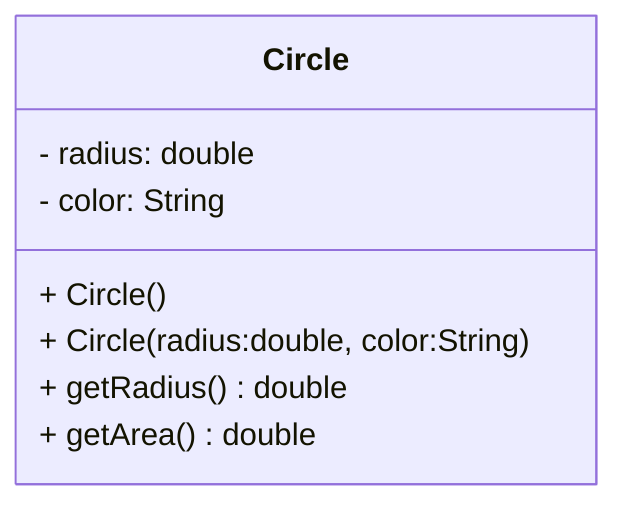

---
aliases:
  - September 2022
tags:
  - PYQ
  - OOP
  - Java
Creation Date: 2024-09-23
Finished Date: 2024-10-02
Completion: true
obsidianUIMode: preview
---
# Section A
## Question 1
### Question A
#### Question I
`Stage` object is passed to the `start` method and `Scene` object is created and added to the `Stage` object. 
#### Question II
```java
Rectangle rect = new Rectangle(20,10, 150,100);
rect.setFill(Color.GREEN);
```
#### Question III
`start()`, `launch()`, `stop()`
### Question B
```java
public void start(Stage primaryStage){
	StackPane stackPane = new StackPane();
	Polygon polygon = new Polygon();
	polygon.getPoints().addAll(
		100.00, 100.00,
		300.00, 100.0,
		100.00, 300.00,
		300.00, 300.00
	);
	
	stackPane.getChildren().add(polygon);
	
	Scene scene = new Scene(stackPane, 400, 400);
	primaryStage.setScene(scene);
	primaryStage.setTitle("Title");
	primaryStage.show();
}
```
### Question C
```run-java
public class Q1_c extends Application{
	public void start(Stage primaryStage){
		Text text - new Text(160, 80, "Programming is fun");
		text.setFont(Font.font("Courier", 20));	
		text.setFill(Color.GRAY);
		StackPane paneForText = new StackPane();
		paneForText.getChildren().add(text);
		
		RadioButton rbRed - new RadioButton("Red");
		RadioButton rbGreen - new RadioButton("Green");
		RadioButton rbBlue - new RadioButton("Blue");
		RadioButton rbBlack - new RadioButton("Black");
		
		ToggleGroup btnGroup = new ToggleGroup();
		rbRed.setToggleGroup(btnGroup);
		rbGreen.setToggleGroup(btnGroup);
		rbBlue.setToggleGroup(btnGroup);
		rbBlack.setToggleGroup(btnGroup);
		
		// not necessary to add 5
		HBox paneForRadioButtons = new HBox(5);
		paneForRadioButtons.getChildren().addAll(rbRed, rbGreen, rbBlue, rbBlack);
		paneForRadioButtons.setAlignment(Pos.CENTER);
		
		rbRed.setOnAction(e->text.setFill(Color.RED));
		rbGreen.setOnAction(e->text.setFill(Color.GREEN));
		rbBlue.setOnAction(e->text.setFill(Color.BLUE));
		rbBlack.setOnAction(e->text.setFill(Color.BLACK));
		
		BorderPane borderPane = new BorderPane();
		borderPane.setTop(paneForRadioButtons);
		borderPane.setCenter(paneForText)
		
		Scene scene = new Scene(borderPane, 500, 200);
		primaryStage.setScene(scene);
		primaryStage.setTitle("Button");
		primaryStage.show();
	}
	public static void main(String[] args){
		launch(args);
	}
}
```
## Question 2
### Question A
```java
import java.io.*
import java.util.Scanner;

public static void main(String[] args){
	File file = new File("bill.txt");
	Scanner fileReader = new Scanner(file);
	double total =0;
	while(fileReader.hasNext()){
		String id = fileReader.next();
		String cat = fileReader.next();
		double price = fileReader.nextDouble();
		int unit = fileReader.nextInt();
		if (cat.equals("Applicances"))
			total += price * unit;
	}
	System.out.printf("The total price is %.2f", total);
	fileReader.close();
}
```
### Question B
Database wide information can be obtained from DatabaseMetaData object. 
Information regarding the table such as database URL, database username, and database product name.
### Question C
```run-java
import java.sql.*
public static void main(String[] args) throws SQLException, ClassNotFoundException{
	String path = "jdbc:ucanaccess://" + System.getPropertu("user.dir").replace("\\", "/") + "/DatabaseLab.accdb";
	Connection conn = DriverManager.getConnection(path);
	if (conn != null)
		System.out.println("Successfully connected to database");
		
	Statement st = conn.createStatement();
	st.executeUpdate("CREATE TABLE Employee(
		id int(3),
		sName varchar(20),
		position varchar(20),
		dept varchar(20),
		primary key(id)
	)");
	
	st.executeUpdate("INSERT INTO Employee(id, sName, position, dept) VALUES(
		122,
		'David',
		'Engineer',
		'Safety'
	)");
	
	st.executeUpdate("INSERT INTO Employee(id, sName, position, dept) VALUES(
		132,
		'John',
		'Clerk',
		'HR'
	)");
	
	st.executeUpdate("INSERT INTO Employee(id, sName, position, dept) VALUES(
		143,
		'James',
		'Operator',
		'QC'
	)");
	
	ResultSet rs = st.executeQuery("SELECT * FROM Employee");
	
	if (rs !=  null)
			System.out.println("Table creation process successfully!");
			
	ResultSetMetaData rsMD = rs.getMetaData();
	for(int index = 1; index < rsMD.getColumnCount(); index++)
		System.out.printf("%s\t", rsMD.getColumnName(index));
	while(rs.next()){
		for(int index = 1; index <rsMD.getColumnCount(); index++){
			System.out.println(rs.getObject(index) + "\t");
		}
	}
}
```
## Question 3
### <mark style="background: #FFF3A3A6;">Question A</mark>
The key benefit of exception handling is the separation of the detection of error, which is done in called method, from the handling of an error, which is done in the calling method. JVM will create an exception object and throw it if the exception needs to be process by its caller when an exception occurs. If the exception can be handled in the method where it occurs, no need to throw or use exception. 

### Question B
```run-java
public class Q3_b{
	public static void main(String[] args){
		Scanner input = new Scanner(System.in);
		try{
			System.out.print("Enter an integer: ");
			int number = input.nextInt();
			System.out.println("Result = " + 20/number);
		}
		catch(ArithmeticException e){
			System.out.println("ArithmeticException");
			throw e;
		}
		catch(InputMismatchException e){
			System.out.println("InputMismatch Exception");
		}
		catch(NumberFormatException e){
			System.out.println("NumberFormat Exception");
		}
		finally{
			System.out.println("finally block");
			input.close();
		}
		System.out.println("program ended");
	}
}
```
#### Question I
```
Result = 4
finally block
progarm ended
```
#### Question II
```
InputMismatch Exception
finally block
program ended
```
#### Question III
```
Arithmetic Exception
finally block
program ended
```
### Question c
**throw** is used to fire the exception when the condition is met
**throws** is used to indicate that the method may fire a certain class of exception when the condition is met.
### Question D

| `Runnable` interface                                                                                | `Thread` class                                                 |
| --------------------------------------------------------------------------------------------------- | -------------------------------------------------------------- |
| `implements Runnable`                                                                               | `extends Thread`                                               |
| Override the `run()` method                                                                         | Override the `run()` method                                    |
| Create an instance of `Thraad` class and pass the task to the object.<br>Call the `.start()` method | Create an instance of the class and call the `start()` method. |
```run-java
public class MyRunnable implements Runnable{
	public void run(){}
}
public class MyThread extends Thread{
	public void run(){}
}
public class Main{
	public static void main(String[] args){
		MyRunnable myRunnable = new MyRunnable();
		Thread thread = new Thread(myRunnable);
		thread.start();
		
		MyThread myThread = new MyThread();
		myThread.start(); 
	}
} 
```
### Question E
```run-java
public class MyTaskClass implements Runnable{
	public static void main(String[] args){
		new MyTaskClass();
	}
	public MyTaskClass(){
		// error is here
		//new Thread(task).run();
		new Thread(this).start();
	}
	public void run(){
		System.out.println("test");
	}
}
```
### Question F
Yes. This is known as race condition. The final value of count is ambiguous as it depends on which thread that is accessing the count variable that finishes first. To fix this, we can add the `synchronized` keyword to the method so that only one thread can access the method at a time.
```java
public class Count{
	int count;
	public synchronized void addMethod(){
		count++;
	}
}
```
# Section B
## Question 4
### Question A
1. `public`
	- So that the JVM can access it when launching the application
2. `static`
	- The JVM can access it without creating an object
3. `void`
	- The program shuts down after all of the statements have been executed, so there is no need to return any value
	- No value is returned anyway
### Question B

|              | -   | Abstract                                                         | Interface                                                                                              |
| ------------ | --- | ---------------------------------------------------------------- | ------------------------------------------------------------------------------------------------------ |
| Field        | -   | no restrictions<br>Can have any instance variables               | must be `public static final`                                                                          |
| Constructors | -   | Constructors can exist but cannot be used to instantiate objects | Cannot implement constructors                                                                          |
| Methods      | -   | No restrictions<br>Can implement any methods                     | The methods defined in an interface must be overridden.<br>The methods must be `public` and `abstract` |
### Question C
1. Encapsulation
2. Abstraction
3. Polymorphism
4. Inheritance
### Question D
#### Question I
Encapsulation is implemented in Java via the access modifiers in classes. The access modifiers can be `public`, `private`, `protected`, or `default`. These access modifiers determine whether the fields and methods of a class is accessible outside of the class that defines them.

*Encapsulation is a mechanism of wrapping the data and code acting on the methods together as a single unit
Data are hidden and protected inside an object and the object controls how it interacts with other variable.
It can only be accessed through methods of the current class*
#### Question II
100
100.
When the line `MyArray myArr = new MyArray(arr)` is executed, since arr is an `array`, the address in memory of arr is passed to the constructor. In the constructor, the line `array = arr`, assigns the address of the original array to the `array` field. This means that any changes applied to the original one applies on the array in the class. This violates the concept of encapsulation because `array` is supposed to be a `private` field, but can be modified outside of the class. 
#### Question III
```java
public MyArray(int[] arr){
	array = Array.copyOf(arr, arr.length);
}
```
#### Question IV
100
10
## Question 5
### Question A
Static variable are variable which is shared across all objects that are instantiated from the same class while instance variables are variables which its values can differ from one object to another object that are instantiated from the same class. Any changes that is applied to the static variable is applied to every object that is instantiated from the class while the changes applied on instance variables are unique and independent of other objects of the same class. To reference a static variable, the class name is called instead of the name of the object. For example, `Circle.radius` and `circleOne.colour`.
### Question B
```java
public class Circle{
	private double radius = 2.0;
	private String color = "blue";
	public Circle(){}
	public Circle(double radius, String color){
		this.radius = radius;
		this.color = color;
	}
	public double getRadius(){return radius;}
	public double getArea(){return Math.PI * Math.pow(radius,2);}
}
```


### Question C
```java
public class Main{
	public static void main(String[] args){
		Circle circle = new Circle();
		System.out.printf("The first Cricle object%n");
		System.out.printf("The circle has radius of %.2f, color of blue, and area of %s", circle.getRadius(), circle.getArea());
		
		Circle circle2 = new Circle(10.0, "yellow");
				System.out.printf("The first Cricle object%n");
		System.out.printf("The circle has radius of %.2f, color of yellow, and area of %s", circle.getRadius(), circle.getArea());
	}
}
```
# Next Paper
[[Past Year Papers/Year 2/Semester 1/Object-Oriented Programming Practices/May 2022|May 2022]]