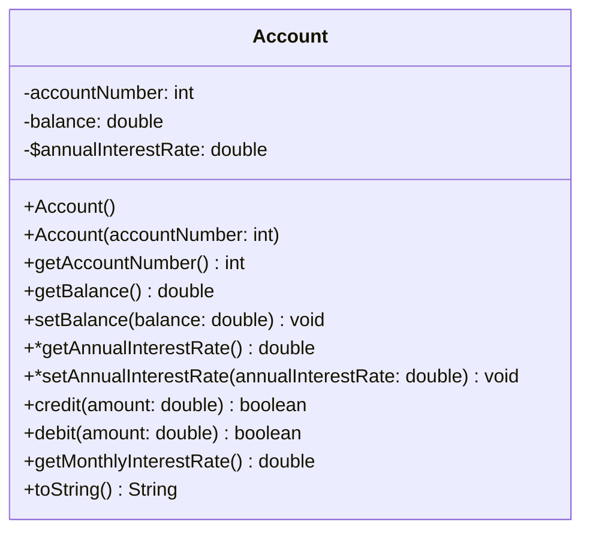

---
aliases:
  - September 2023
tags:
  - PYQ
  - Java
Creation Date: 2024-09-18
Finished Date: 2024-09-18
Completion: true
obsidianUIMode: preview
---
# Section A
## Question 1
### Question A
#### Question I
`setOnMousePressed`, `setOnMouseClicked`, `setOnMouseDragged`
#### Question II
A flight company would like to find out the customers' experience with the airline, so they made and distributed an online form. TextArea is used when a long answer is expected from the user. For example, the text area for suggestions or description of the problem. TextField is used when a short and medium answer is expected from the user. For example, contact number or email from the user. 

### Question B
```run-java
public void start(Stage primaryStage){
	Button vegies = new Button("Vegies");
	Button rice = new Button("Rice");
	
	TextArea text = new TextArea("This is the text area");
	
	BorderPane root = new Pane();
	root.setTop(vegies);
	root.setCenter(text);
	root.setBottom(rice);
	
	BorderPane.setAlignment(vegies, Pos.CENTER);
	BorderPane.setAlignment(rice, Pos.CENTER);
	
	Scene scene = new Scene(root, 300, 250);
	primaryStage.setScene(scene);
	primayrStage.show();
}
```
### Question C
```run-java
public class Question_1c extends Application{
	@Override
	public void start(Stage primaryStage){
		// Pane pane for placing the arc
		Pane pane = new Pane();
		Arc[] arcs = new Arc[4];
		Text[] txts = new Text[4];
		
		arcs[0] = new Arc(100, 100, 80, 80, 0, 360*0.7);
		arcs[0].setFill(Color.LIGHTCORAL);
		arcs[0].setType(ArcType.ROUND);
		txts[0] = new Text(65, 70 , "Smartphone");
		
		arcs[1] = new Arc(100, 100, 80, 80, 0.7*360, 0.15*360);
		arcs[1].setFill(Color.WHITE);
		arcs[1].setType(ArcType.ROUND);
		txts[1] = new Text(100, 75 , "Laptop");
		
		arcs[2] = new Arc(100, 100, 80, 80, 0.85*360, 0.10*360);
		arcs[2].setFill(Color.GRAY);
		arcs[2].setType(ArcType.ROUND);
		txts[2] = new Text(80, 65 , "Desktop");
		
		arcs[3] = new Arc(100, 100, 80, 80, 0.95*360, 0.05*360);
		arcs[3].setFill(Color.RED);
		arcs[3].setType(ArcType.ROUND);
		txts[3] = new Text(80, 65 , "Tablet");
		
		for(int index = 0; index < 4; index++)
			pane.getChildren.addAll(arcs[index], txts[index]);
		
		HBox hBox = new HBox();
		hBox.setSpacing(10);
		hBox.setAlignmnet(Pos.BASELINE_LEFT);
		Button btChartCol =  new Button("Chart Color");
		Button btFontCol = new Button("Font Color");
		Button btPosition = new Button("Shift Left");
		hBox.getChidlren().addAll(btChartCol, btFontCol, btPosition);
		
		btCharCol.setOnAction(e->{
			arcs[0].setFill(Color.RED);
			arcs[1].setFill(Color.YELLOW);
			arcs[2].setFill(Color.GREEN);
			arcs[3].setFill(Color.BLUE);
		});
		
		btFontCol.setOnAction(e->{
			Color pickedColor = colorPicker.getColor();
			for (Text text: txts)
				text.setFill(pickedColor);
		});
		
		btPosition.setOnAction(e->{
			for(int index = 0; index < 4; index++){
				arcs[index].setX(getX() + 10);
				txts[index].setX(getX() + 10);
			}
		});
		
		BorderPane borderPane = new BorderPane();
		borderPane.setCenter(pane);
		borderPane.setPadding(new Insets(10));
		borderPane.setBottom(hBox);
		BorderPane.setAlignmnet(hBox, Pos.BOTTOM_CENTER);
		
		Scene scene = new Scene(borderPane, 300, 250);
		primaryStage.setScene(scene);
		primaryStage.show();
	}
	public static void main(String[] args){
		launch(args);
	}
}
```
## Question 2
### Question A
#### Question I
`FileInputStream` is used to read from a Binary File. It is accompanied by `DataInputStream`.
```run-java
FileInputStream fstream = new FileInputStream("example.dat");
```
#### Question II
When writing:
Text I/O requires conversion form Unicode to file specific encoding 
binary I/O copies the original byte into the binary file

When reading:
File I/O requires conversion from file specific encoding to Unicode format
Binary I/O reads the original byte from the binary file
### Question B
```run-java
public class Main{
	public static void main(String[] args) throws IOException{
		Scanner reader = new Scanner("Rating.txt");
		FilWriter fileWriter = new FileWrite("Ranking.txt");
		PrintWriter outFile = new PrintWriter(fileWriter);
		while(reader.hasNext()){
			double score = 0;
			String name = reader.next();
			double goal = reader.nextDouble();
			double assit = reader.nextDouble();
			score += 0.6 * goal + 0.4 * assit;
			if (score <= 0.8)
				ranking = "Excellent";
			else if ((score >= 0.6) && (score < 8.0))
				ranking = "Good";
			else if ((score >= 0.4) && (score < 0.6))
				ranking = "Acceptable";
			else 
				ranking = "Worst";
				
			outFile.printf("%s\t%s\n", name, ranking);
		}
	}
}
```
### Question C
#### Question I
The JDBC API provides a lot of methods which makes it easier to manipulate a database remotely.
Allows users to execute SQL statements, retrieve results,  and present data in user friendly interface.
#### Question II
```run-java
import java.sql.*
public class Main{
	public static void main(String[] args){
		String path = "jdbc:ucanaccess://" + System.getProperty("user.dir").replace("\\", "/") + "/DatabaseLAb.accdb";
		Connection conn = DriverManager.getConnection(path);
		if (conn != null)
			System.out.println("Successfully connected to dtabase");
		Statement st = conn.createStatement();
		// st.executeUpdate("INSERT INTO Salary VALUES (1, 'Paul', 'Chen', 'Sale', 3000.0)");
		ResultSet rs = st.executeQuery("SELECT * FROM Salary");
		if (rs != null){
			System.out.println("Table creation process successfully!");
			ResultSetMetaData rsMD = rs.getMetaData();
			int columnCount = rsMD.getColumnCount();
			for(int index = 1; index <= columnCount; index++)
				System.out.printf("%s\t", rsMD.getColumnName(index));
			System.out.println();
			while(rs.hasNext()){
				for(int index = 1; index < columnCount; index++){
					System.out.printf("%s\t", rs.getString(index));
			}
		}
	}
}
```
## Question 3
### Question A
Checked exceptions are exceptions that the compiler forces the programmer to deal with while unchecked exceptions are exceptions that compiler does not require the programmer to deal with. Examples of unchecked exceptions are `RuntimeException` and `Error` while everything else is a form of checked exception
### Question B
One way to handle an exception is to use a `try-catch` block. The statements that may cause exception is placed in the `try` block while the statements to deal with the exception is placed in the `catch` block
```run-java
public static void main(String[] args){
	int numerator = 5;
	int denominator = 0;
	int result;
	try{
		result = numerator/denominator;
		System.out.println(result);
	} catch(ArithmeticException e){
		System.out.println("Divisioin by 0!");
	}
}
```
### Question C
```run-java
public static void Q3_c(double m, double n){
	try{
		System.out.println(divide(m,n));
	}catch(IllegalArgumentException e){
		System.out.println("The divisor is zero");
		/*
		e.printStackTrace();
		System.out.println(e);
		System.out.println(e.getMessage());
		*/
	}
}
```
### Question D
A thread is the flow of the execution of a task to be executed. Multithreading is needed to allow multiple tasks to be executed concurrently
### Question E
```run-java
class Demo implements Runnable{
	public void run(){
		Sytem.out.println("Thread is in Running state");
	}
	public static void main(String args[]){
		Demo demo = new Demo();
		Thread thread = new Thread(demo);
		thread.start();
	}
}
```
### Question F
```run-java
public class FirstThread implements Runnable{
	public static void main(String[] args){
		new FirstThread();
	}
	public FirstThread(){
		new Thread(this).start();
	}
	public void run(){
		System.out.println("Test");
	}
}
```
### Question G
No. The method is exposed to manipulation from multiple threads simultaneously. The value of count is unknown and is dependent on the thread that finishes last. 
### Question H
A race condition happens when multiple threads are trying to access the same resource. This can be avoided by restricting the resource so that it is only accessible by one thread at a time. This can be done with `synchronized` or `lock`.
# Section B
## Question 4
### Question A
The data fields of an abstract class can be `static`, `final`, `public`, `private`, `protected`, `default`, but the data fields of an interface class can only be `public static final`. The abstract class can have constructors but interface class cannot have constructors. Abstract class have both concrete and abstract methods but interface can only have public abstract methods
### Question B
Encapsulation is the act of hiding data and information between classes. It is done in the implementation level. It is implemented via the access modifiers.
### Question C
#### Question I
15, and 15. Since arrays are reference type objects, when creating an MyArray object, the address of the array is passed. This means that the array in the object points to the same address as the original array. So, when the original array is manipulated, the array in the object is changed as well. This makes the immutable data field unintentionally mutable, making it susceptible to outside manipulation.  
#### Question II
```java
import java.util.Arrays;

public MyArray(int[] arr){
	array = Arrays.copyOf(arr, arr.length);
}
```

```java
public myArray(int[] arr){
	this.array = new int[arr.length];
	
	for(int index = 0; index < arr.length; index++)
		array[index] = arr[index];
}
```
#### Question  III
15, 10
### Question D
#### Question I
```java
import java.util.Math;

public class Circle{
	private double radius;
	private String color;
	public Circle(){radius = 1; color="red"};
	public Circle(double radius, String color){
		this.radius = radius;
		this.color = color;
	}
	public double getArea(){return Math.PI*Math.POW(radius, 2);}
}
```
## Question 5
### Question A
```java
public class Account{
	private int accountNumber;
	private double balance;
	private static double annualInterestRate;
	public Account(){}
	public Account(int accountNumber){
		this.accountNumber = accountNumber;
		this.balance = 0.0
	}
	public int getAccountNumber(){return accountNumebr}
	public double getBalance(){ return balance; }
	public void setBalance(double balance){this.balance = balance;}
	public static double getAnnualInterestRate(){return annualInterestRate; }
	public static void setAnnualInterestRate(double annualInterestRate){
		this.annualInterestRate = annualInterestRate;
	}
	public boolean credit(double amount){
		setBalance(this.balance + amount);
		return true;
	}
	public boolean debit(double amount){
		if(amount > balance){
			setBalance(this.balance - amount);
			return true;
		}
		return false
	}
	public double getMonthlyInterestRate(){return annualInterestRate/12;}
	@Override
	public String toString(){
		return String.format("A/X no: %d, Balance = %.2f, Monthly Interest = %.2f", getAccountNumber(), getBalance(), getMonthlyInterestRate());
	}
}
```
### Question B
#### Question I
```java
public class AccountTest{
	public static void main(String[] args){
		Account acc = new Account(1234);
		acc.setBalance(10_000.00);
		Account.setAnnualInterestRate(0.02);
		System.out.println(acc);
	}
}
```
#### Question II
```java
if(acc.debit(10_001) == false)
	System.out.println("The requested amount exceeds your current balance!");
System.out.println(acc);
```
### Question C

# Next Paper
[[Past Year Papers/Year 2/Semester 1/Object-Oriented Programming Practices/May 2023|May 2023]]


