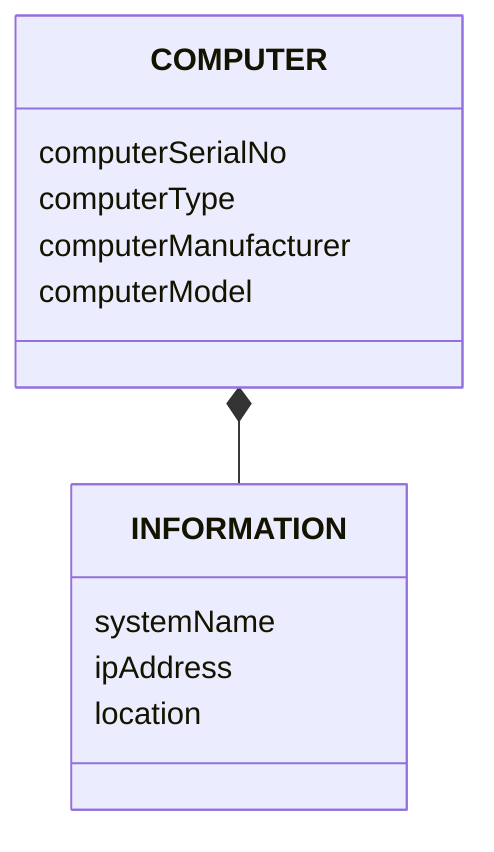

---
aliases:
  - May 2023
tags:
  - PYQ
  - Database
Date: 2025-05-22
Finished Date: 2025-05-22
Completion: true
obsidianUIMode: preview
---
# Section A

## Question 1

### Question A

#### Question I

>[!TIP]- How to Answer?
>Talk about whether each point (allowed or disallowed, or as characteristics) and what it means.
>
>1. Null values:
>	- Primary key does not allow null allows
>		- So that each instance is identifiable
>	- Foreign key allows null values
>		- This is for optional participation in a relationship
>2. Record uniqueness:
>	- Primary key has to be unique in each tuple
>		- This is to ensure that every tuple is uniquely identifiable and there is no mixing
>	- Foreign key can be allowed to be repeated
>		- This is to indicate one-to-many or many-to-many relationships
>3. Referencing method:
>	- Primary key is the target that the foreign key in other relations point to. 
>	- Foreign key can only reference existing primary key values in other relations.

1. Nullability
	- Primary key does not support null values 
		- So that every tuple in the relation is identifiable 
	- Foreign key is allowed to be nullable
		- This is the case during optional participation in a relationship.
2. Uniqueness
	- Primary key has to be unique in each tuple
		- This is to ensure that every tuple is uniquely identifiable and there is no mixing
	- Foreign key can be allowed to be repeated
		- This is to indicate one-to-many or many-to-many relationships
3. Referencing method
	- Primary key is the target that the foreign key in other relations point to. 
	- Foreign key can only reference existing primary key values in other relations.

#### Question II

>[!TIP]- How to Answer
>Keep it simple, `Employee` and `Department` or `Staff` and `Branches`

The relationship between staff and branch where one staff can manage a lot of branches, and one branch can only be managed by one staff.

staffs (staffsNo \<pk>)
branches (branchesNo \<pk>, staffsNo \<fk>)

### Question B

>[!TIP]- How to Answer?
>Talk about the disadvantages of views
>1. Update restriction
>	- Talk about the specific conditions that allows it to be updatable 
>2. Performance
>	- It is a dynamic relation created on request
>3. Dependency problem
>	- It relies on base relations. If something happens to the base relation, the view is gone too
>4. Structure restriction
>	- Talk about how views would be restricted to read-only

1. Update restriction
	- Views are only updatable under a set of circumstances. These are, the SELECT clause can only include fieldnames, no functions or calculations. It involves one relation and contain the primary key attribute of the relation. It should not involve more than one relations. It should not have GROUP BY or ORDER BY clause. No nested query
2. Structure restriction
	- Base relations allow the user to view the entire relation, while view restricts the user to view only a subset of the relation. 
3. Performance
	- Since views are dynamic and virtual tables, they are generated on request. If there are multiple users creating views at the same time, the performance of the system may degrade. 
	- If the views involved complex queries and is executed at a large scale, the performance will also diminish

### Question C

#### Question I

>[!TIP]- How to Answer?
>Read the passage properly

This is composition. This is because the information of the computer, such as the IP address is tied to the computer. 

#### Question II

### Question D

>[!TIP]- How to Answer?
>Think about the operations in the transaction
>1. Calculations or comparison with null values
>	- Inaccurate result
>		- Analysis can be affected
>			- Salary analysis
>2. Joining tables with null values
>	- Inner joins cannot be used
>		- Results in some rows not appearing due to missing matching values
>		- Incomplete dataset
>	- User would have to use outer join
>

1. Problem when joining relations
	- The use of inner join would lead to some rows being missing at the rows would be missing matching values to join with, leading to inaccurate or incomplete dataset. This would result in loss of important data, especially during analysis. 
	- This can be solved with using outer join.
2. Problem when data calculation and data
	- Null values can lead to ambiguity and unreliable results.
	- During calculations, `Null` values are usually ignored, but this would lead to inaccurate results which will affect analysis. 

## Question 2

### Question A

#### Question I

>[!TIP]- How to Answer?
>1. Media Failure
>2. Instance Failure
>3. Network Failure
>4. User Process Failure
>5. Statement Failure
>6. User Error

1. Media failure
	- The file that is needed for certain database operation is missing
2. Instance failure
	- The database instance shuts down unexpectedly

#### Question II

>[!TIP]- How to Answer
>Don't say redo and undo

1. Roll-forward
	- Reapply committed transactions from the transaction log beginning from the last checkpoint to the point of failure to return the database back to its consistent state. 
2. Roll-backward
	- The operations of a transaction that has not committed in the event of a failure will be undone to ensure data integrity. 

### Question B

#### Question I

>[!TIP]- How to Answer
>Find out what is wrong, and what it means from the broader perspective.
>
>- Transaction T1 is holding a lock on records in the CUSTOMER relation while requesting locks on records in the SALES table.
>- Transaction T2 is holding a lock on records in the SALES table which is needed by T1, and is also requesting lock a lock on record which is being held by Transaction T1.
>
>---
>
>Problems
>1. Concurrency control
>	- Multiple transactions are attempting to access the same resources simultaneously.
>2. Circular wait
>	- T2 is waiting for a lock on a data item held by T1 to be released.
>	- T1 is waiting for a lock on a data item held by T2 to be released.

1. Concurrency control
	- Multiple transactions are attempting to access the same resources simultaneously.
2. Circular wait
	- T2 is waiting for a lock on a data item held by T1 to be released.
	- T1 is waiting for a lock on a data item held by T2 to be released.

#### Question II

>[!TIP]- How to Answer
>Circular wait = Deadlock
>Talk about what causes it, and the name of it.

The transactions are in the state of deadlock. This is because transaction T1 and T2 are both waiting for locks that are being held by each other. This is the result of Hold and Wait, where the transactions requests for more locks while having a lock on a data item. 

#### Question III

>[!TIP]- How to Answer
>The way is to simply abort any of the transaction until the deadlock is gone.
>1. Timeout
>2. Deadlock prevention
>3. Deadlock detection and recovery

1. Timeout
	- Assign a time limit for each transaction
	- Abort the transaction once the time limit is over
2. Deadlock Prevention
	- The DBMS looks ahead to see if the transactions will cause a deadlock and never allow it
	- Timestamp transaction
		- Wound-Wait -> Only allows older one to wait
		- Wait-die -> Only allows younger one to wait
3. Deadlock Detection and Recovery
	- Lets deadlock happen but recognises it and breaks it
	- If there is a cycle in the Wait-For-Graph, deadlock exists

### Question C

>[!TIP]- How to Answer?
>>[!WARNING] DISCLAIMER
>>Although, the question only asks for DEFFERED UPDATE and IMMEDIATE UPDATE, I will answer it as if it involves SHADOW PAGING
>
>1. Use of transaction log files
>2. Recovery technique for uncommitted transaction
>3. Recovery technique for committed transactions
>4. Timing of updates

1. Timing of update to the database
	- In deferred update, the updates from the transaction is only written when the transaction has been committed
	- In immediate update, the updates from the transaction is written into the database as the transaction progresses
	- In shadow paging, the current page keeps a record of the changes made to the database. Once committed, the current page becomes the new shadow page
2. Technique used to recover from an error before the transaction has committed
	- Deferred update does not need to perform any recovery technique since its updates are only applied to the database when the transaction has committed.
	- Immediate update has to perform roll-forward as the updates are applied as the transaction progresses.
	- Shadow paging does need to perform roll-forward or roll-backward; it would only discard the current page and the shadow page remains as the valid page for the database to revert to
3. Technique used to recover from an error after the transaction has committed
	- Deferred update will use roll-forward
	- Immediate update will use roll-backwards
	- Shadow paging does not perform any recovery technique as the current page would have been considered a valid state and is now the new shadow page. 

## Question 3

### Question A

>[!TIP]- How to Answer
>This part is the easiest of the paper, so I won't talk much other than *keep it simple and don't extend anything unless necessary*

#### Question I

1. Manufacturer
	- Primary key
		- m_name
	- Foreign key
		- None
2. Part
	- Primary Key
		- partID
	- Foreign Key
		- m_name referenced from Manufacturer m_name
3. Customer
	- Primary key
		- custID
	- Foreign key 
		- None
4. Order
	- Primary key
		- orderID
	- Foreign key
		- custID referenced from CUSTOMER custID
5. Contains 
	- Primary key
		- partID 
		- orderID 
	- Foreign key
		- partID referenced from Part partID
		- orderID referenced from Order orderID

#### Question II

Composite attribute 
1. Address. The value of address can be split into house number, street, postcode, city, state. 

Multivalued attribute
1. partDescription. The description may be one-word description in which case would mean that the parts would contain multiple description words. 

### Question B

>[!TIP]- How to Answer
>When it comes to example, choose one and stick with it.
>A common and simple one is anything relation to money. 

1. Atomicity
	- All of nothing property
	- Either all of the operations in the transaction commits or none of it
	- For example, if 50$ would be subtracted from Savings account and then 50$ would be added into Checking, either both operations complete successfully, or if there is an error after the first operation, the 50$ is put back into Savings
2. Consistency
	- The committed transaction should shift the database into a new state
	- For example, once the transaction is completed, the amount of Savings should have 50$ dollars less and the Checking should have 50$ mores. 
3. Isolation
	- The partial effect of an uncommitted transaction should not be visible to another transaction
	- For example, If users is trying to view the amount in the Savings account and Checking account while the initial transaction is executing, the user will only see the amount in Savings and Checking before they been updated or after they have been updated. The user will not see that 50$ has been subtracted from Savings, but not added into Checking.
4. Durability
	- The effects of the committed transaction should not be lost in the event of a failure
	- For example, when the banking system fails, the updated amount in Savings and Checking should remain 50$ less and 50$ more respectively. 

### Question C

#### Question I

$\pi_{\text{sName}}(\sigma_{\text{colour = "red"}} \text{Parts})$

#### Question II

$\pi_{\text{price}}((\sigma_{\text{colour = "red"} \cup \text{colour = "reen"}}  \text{Parts}) \bowtie \text{Catalog}$

# Section B
## Question 4

### Question A

#### Question I

1. Local DBMS component
	- Standard DBMS which is responsible managing local data at sites with database
	- Assuming that *XYZRetail* would have branches at different locations and region, there should be a local DBMS which is responsible to handle financial transactions and processing for each specific region, allowing for a faster processing as data is fetched from the closest database server.
2. Data communication component
	- This is needed to allow different sites or branches to communicate with each other.
	- For example, if the company would like to have a company-wide customer analysis, this component will allow it to fetch data from fragments located at different branches. 
3. Global system catalogue
	- This stores information related to the nature of the distributed system
	- This is important for the company to keep track of the fragmentation strategy used to partition the company's data, location of each fragment, and how replication is done for each fragment. This is useful for when the company would like to perform auditing.
4. Distributed DBMS component
	- This is the controlling unit of the distributed DBMS
	- This component allows the company to ensure consistency, concurrency control, and integrity control in all of the fragments across the branches. 

#### Question II

>[!TIP]- How to Answer?
>Idk, just remember these I guess

1. Extended concurrency control
	- XYZRetail needs to <mark style="background: #FFF3A3A6;">manage simultaneous data across multiple sites.</mark> This involves coordinating locks, timestamps, and transactions across multiple locations to ensure consistency throughout the company's distributed system
2. Extended security control
	- Security involves managing user authentication and authorisation across multiple, remote sites, as well as securing the transmission of data from one site to another.
	- XYZRetail needs this extended functionality to protect their data spread across different parts of the distributed system
3. Extended communication services
	- This involves handling data transfer, message routing, and managing network protocols between the dispersed locations of the distributed database.
4. Extended recovery services
	- Must handle failures at individual sites or the network connecting them. 
	- This is needed to ensure that the distributed database is restored to a consistent state after a failure, ensuring data reliability across all sites.
5. Extended data dictionary
	- A DDBMS maintains a global data dictionary that contains information about the distributed database such as the location of the data fragments, how they are replicated, and how they should be combined. 
	- XYZ retail need this to effectively manage data fragments that are distributed to different sites
6. Distributed query processing
	- Query processing in a DDBMS involves planning and executing queries that may need to access and combine data from multiple sites. 
	- The DDBMS optimizes these distributed queries by minimizing network traffic to efficiently retrieve results for users accessing XYZRetail's data from different locations.

#### Question III

1. Lost update
	- Happens when the final result of a committed transaction is overridden by another user.
	- In this case, it can happen when two different branches or sites are updating a data item, such as , simultaneously, leading to uncertainty in the final value as its value would depend on the relative timing of the execution of the transactions.
2. Uncommitted dependency problem
	- Happens when one transaction is allowed to see the partial effect of uncommitted transaction. 
	- This happens when one branch is able to view the data item that is being updated by a transaction by another branch. 
3. Inconsistent Analysis problem
	- If the company would like to have a company-wide analysis on customer activity, some branches may have data that has not been updated yet or is being updated. This inconsistency leads to an inaccurate report.

### Question B

1. SQL is made to handle structured data while NoSQL can handle both structured and unstructured data.
	- For example, SQL is used to keep track of relational data such as company's staff records while NoSQL can be used to keep track of images, text, videos, and audio gathered from social media applications such as Facebook or Instagram
2. The data structure for SQL is rows and columns while the data structure for NoSQL can be key-value pair, document-based, column-based, and graph-based
	- For example, A company may use SQL to store staff data with tables that has rows and attributes which each field storing only one value, while a social media company such as Meta may use graph-based where nodes and edges are used to represent the relationship between the instances. 

### Question C

1. Connectivity issue 
	- The mobile device must have a strong and stable connection to ensure that no data is loss or corrupted during data transfer to transaction
2. Security
	- Since Mobile DBMSs rely on wireless connection, a malicious user may be able to intercept and steal company data. 

## Question 5
*Optional*
# Next Paper
[[]]