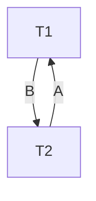

---
aliases:
  - May 2024
tags:
  - PYQ
  - Database
Date: 2025-05-22
Finished Date: 2025-05-22
Completion: true
obsidianUIMode: preview
---
# Section A
## Question 1
### Question A

>[!HINT]- How to answer
>1. *Update restriction*
>	- *Talk about how base relations are generally directly updatable, given that you have the appropriate role and privilege*
>	- *Talk about the conditions that restrict view's updatability*
>2. *Structure restriction*
>	- *Views are restricted to the query. You don't actually see the entire base relation.*
>3. *Performance*
>	- *It is a dynamic and virtual table generated on user request. So, if there is a lot of users requesting for views, performance will suffer.*
>4. *Dependency issue*
>	- *Views are dependent on the base relation. If changes are made the underlying base relations, the views generated from the affected base relations may have to be changed as well. The views may have errors too.*
>
>View:
>- It is a virtual table
>- It is dynamically generated per user request
>- View can be customised for each user
>- Changes made to the attributes in base relation that is involved in the creation of view will be reflected in the view

---

Disadvantages
1. Update Restriction
	1. A view's ability to be updated is dependent on several conditions:
		- SELECT clause can only include fieldnames. No functions or calculations
		- No ORDER BY or GROUP BY clauses
		- Does not involve multiple base relations
		- No nested queries
		- Contains only one base relation and the unique key or candidate key of the base relation. 
2. Structure restriction
	- The relational operations that can be applied on the view is dependent on how it is made. 
	- If it involves complex functions or joining tables, the view created will be read-only.
3. Performance
	- Since views are dynamically generated, the speed to generate the view is dependent on the complexity of the search condition. 
	- If the search condition is complex and there are a lot of users generating views, the performance will be worse such as slower generation of views.
4. Dependency problem
	- Views are dependent on the underlying base relations. This means that when changes are made to the base relations, changes also have to be made to the views to ensure that there is no error or ensure that the output of the view is still consistent.

### Question B

>[!HINT]- How to answer
>*Describe what inheritance and specialisation are. Give an example*
>1. *Inheritance*
>	- Property that allows one or more child entities to have the same properties or relationships of a supertype.
>	- The relationship between the subtypes and the supertype is a "kind-of" relationship, where the child entities are more specific entities, while supertypes are the more generic entity
>2. Specialisation is a top-down approach to determine the child entities from the supertype. This method determines the specific child entities that can be derived from the super type. 
>3. Example
>	- `Employee` entity as the supertype and `Programmer` as the child type. `Programmer` will inherit properties and relationship from `Employee`, while having its own unique properties and relationships. For example, name, dob, and gender are properties inherited by `Programmer` and a relationship with `Deparment` is also inherited. `Programmer` can have its own unique property, `programming_language`.

---

Inheritance is a property that allows one or more child entities to have the same properties or relationships of a supertype. Inheritance also allows the subtypes to have their own unique attributes. Specialisation is a process that defines a set of subtypes from one supertype via a top-down approach. This method determines the specific child entities that can be derived from the super type. The relationship in the specialisation hierarchy is described to be a "is-a" relation, similar to inheritance.

For example, `Employee` entity as the supertype and `Programmer` as the child type. `Programmer` will inherit properties and relationship from `Employee`, while having its own unique properties and relationships. For example, name, dob, and gender are properties inherited by `Programmer` and a relationship with `Deparment` is also inherited. `Programmer` can have its own unique property, `programming_language`.

### Question C

>[!HINT]- How to answer
>*Think about what each one is, their characteristics and purposes*
>1. *Entity Integrity*
>	1. *For individual base relations*
>	2. *Not nullable*
>	3. *No repetition*
>	4. *To uniquely identify tuples in a base relation*
>2. *Referential integrity*
>	1. *Can involve one or more tables*
>	2. *Depends on the degree of relationship*
>	3. *Nullable*
>		- Depends on the participation of the relationship
>	4. *Must match a value of a primary key in the other relation*
>		- *Indicate connection*
>	5. *To indicate relationship between relations*

---

1. Nullability
	1. Entity integrity involves primary keys, which can be one attribute or a set of attribute. The primary key cannot be null to ensure that every tuple can be identified
	2. Referential integrity involves foreign key, where depending on the participation of the relationship, can be null. If it is null, this means that there is no relationship between the instance in the child table and any instances in the parent table
2. Number of relations involved
	1. Entity integrity has to be enforced in each individual relation. Entity integrity is applied to the primary key within a single base relation. 
	2. Referential integrity will involve one or more relations, depending on the degree of the relationship.
		1. Unary involves only one and itself
		2. Binary involves two 
		3. Ternary involves three
3. Purpose
	1. Entity integrity is to ensure that every tuple in a relation is uniquely identifiable. This is why the value for every primary key cannot be repeated
	2. Referential integrity is important to maintain the relationship between relations. This is why the value must match an existing value of primary key in the other relation. 

### Question D

>[!HINT]- How to answer
>*Find keyword: is-a, kind-of, has-a*
>1. *has exactly*
>	- Generalisation relationship is describe as "is-a" relationship.
>	- This means the relationship is not a generalisation relationship
>2. *one wheel belongs to exactly one car*
>	- This means that the wheel cannot be moved to another car. So, it has dependent existence. If the car does not exist, the wheel would not exist too
>3. *Dependent lifespan*
>	- If the car dies, the wheel dies with it. This is the characteristics of composition

---

It is Composition
1. The relationship is described as "has exactly"
	- The relationship described is generalisation is "is-a" relationship
	- This means that generalisation cannot be the relationship
2. Inability to exists separately
	- It is stated that each wheel belongs to exactly one car, meaning the wheel cannot be replaced or move to another car. 
	- One part is exclusively owned by one whole. 
	- This is a characteristics of composition.
	- In aggregation, one part is not exclusively owned by one whole
3. Dependent lifespan
	- When the car dies, the wheel dies with it.
	- This is a characteristics of the composition, the part's lifespan is dependent on the whole. 
4. Integral and Constituent Part
	- Although wheel can exist on its own, its function is integral to the car.
	- This is characteristics of composition

## Question 2

### Question A

#### Question I

#### Question II

Deadlock exists. This is because $\text{T}_{1}$ is requesting a lock on item B which is held by $\text{T}_{2}$ and cannot continue until it has data item B, and $\text{T}_{2}$ is requesting a lock on item A which is being held by $\text{T}_{1}$ and cannot continue until it has a lock on the data item A. This creates a cycle in the Wait-For-Graph.

#### Question IIII

1. Statement failure
	- A single database operation - select, insert, update, or delete - fails
2. Media failure
	- The file needed for database operation is missing
3. Network failure
	- Connectivity to the database is lost unexpectedly while the transactions are still active.
4. Instance failure
	- A single database instance shuts down unexpectedly while the transaction are still active
5. User Error
	- The operations are successful but incorrect
6. User Process Failure
	- The application program running the transaction crashes

#### Question IV

1. Roll-backward operations
	- The operations of a transaction that has not been committed at the time of failure is undone. 
2. Roll-forward operations
	- The operations of a transaction that has committed is redone.

### Question B
1. Atomicity
	- It is an all or nothing property where either every operations in the transactions are committed or none of them commits. 
	- For example, an operation to subtract 50 dollars from Savings and another operation that adds 50 dollars into Checking. If an error occurs after the first operation and before the second operation, the entire transaction is undone. 
2. Consistency 
	- Committed transactions must shift the database from one consistent state to another valid, consistent state.
	- Data integrity
	- For example, after the 50 dollars subtraction from the Savings account operation and 50 dollars addition to the Checking operations are committed, the new value should be shown in the database. 
3. Isolation
	- The partial effect of uncommitted transaction should not be visible to other transactions
	- For example, while the previous first transaction is executing, another user wants to view the Savings account balance. The user will only see the balance before the 50 dollars subtraction if the transaction has not yet completed or after the 50 dollars subtraction if the transaction is completed. The user will not see an intermediate result where the subtraction occurs, but addition to the Checking has not.
4. Durability
	- The effects of committed transaction should be permanent and is not lost in future error. 
	- When there is an error and the system restarts, the Savings balance should have deducted 50 and the Check balance should have incremented by 50.

## Question 3

### Question A

1. orders
2. clients
3. products
4. staffs

5. orders_products

### Question B

orders (order_id \<pk>, order_date, client_id \<fk>, staff_id \<fk>)
clients (client_id \<pk>, client_name, client_address, client_phone)
products (product_id \<pk>, product_desc, unit_price)
staffs (staff_id \<pk>, staff_name)
orders_products (order_id \<pk, fk>, product_id \<pk, fk>, quantity)

### Question C

1. orders
	- Primary key 
		1. order_id
	- Foreign key
		1. client_id
		2. staff_id
2. clients
	- Primary key
		1. client_id
	- Foreign key
		2. None
3. products
	- Primary key
		1. product_id
	- Foreign key
		1. None
4. orders_products
	- Primary key
		1. product_id
		2. order_id
	- Foreign key
		1. product_id
		2. order_id
5. staffs
	- Primary key
		1. staff_id

### Question D

Relationship between customers and orders:
- one-to-many
Relationship between staffs and orders:
- one-to-many
Relationship between orders and products
- many-to-many
- A junction table is needed to resolve the relationship. 
	- orders_products table

### Question E

![[staff_product_erd.png]]

# Section B

## Question 4

### Question A

#### Question I

1. Fragmentation
	- The data is split into multiple fragments.
	- In ABCAdvisory case, there should be more than 1000 fragments with each site having their relevant fragments.
	- This can cause complexity in managing fragments
2. Replication
	- Certain fragments are replicated and sent to multiple sites. 
	- This can happen if there is a data that is frequently accessed in multiple different sites
	- For example, if multiple branches in ABCAdvisory wants to access company-wide standardised service definitions and pricing guidelines, these can be replicated on each site, allowing the employees to access the data without repeated querying the central site, saving a lot of time and improve performance. 
3. Allocation
	- Each fragment is allocated to their respective site. Each site should only contain relevant data. 
	- Selecting relevant fragments for relevant sites is important to ensure that unauthorised users can't access the data
	- For example, local data of branch A should not be present in branch B of ABCAdvisory so that data of branch A is protected when branch B is compromised. 
#### Question II

>[!HINT]- How to answer
>1. List the benefits (Assume each one is one mark)
>2. Provide elaboration (Assume each is one mark) 
>3. Provide and example (Assume each is one mark)
>   
>For the examples:
>1. Talk about consistency and uniformity, especially in services.  
>2. Talk about errors, and costs
>3. Talk about expansion
>	- Since they're the same DBMS, copy and paste
>4. Talk about quick complex query processing via load-sharing and importance in time-sensitive services. 
>Mention the company and the services that it provides

---

1. Homogenous
	1. Multiple sites share the same DBMS
		- This allows ABCAdvisory to have uniformity and standardisation across different sites, ensuring a consistent database system, and ultimately allowing them to provide consistent service to their customer.
		- Simplifying the overall system design and management.
	2. Easier to design and manage (*Relates to the first point*)
		- Errors can be costly, especially with 1000 locations and related to financial services Wsuch as auditing, consulting, financial advices, taxes and legal services.
		- This means that the staff only has to learn one DBMS rather than multiple DBMS, reducing the chances of error. 
		- This also makes it easier to make changes to databases.
	3. Easier to add new sites
		- This allows ABCAdvisory to easily expand their locations and sites.
		- Since each site will use the same DBMS, ABCAdvisory can copy most of the already determine configuration for the new sites and add additional minor changes as necessary, saving a lot of time and money.
	4. Allows load sharing of query processing
		1. Parallel processing of multiple sites
			- Allows quicker query processing. 
		- This means that if one of ABCAdvisory's site is experiencing high demand, the query load can be distributed to other available servers in the homogenous DBMS. This ensures client experience quick query processing and access to information, where speed is important in time-sensitive advisory services.
2. Heterogenous (*I'm gonna stick to homogenous*)
	1. Multiple sites use different DBMS
	2. Often the case when database is built without scalability in mind. 
	3. Requires translation to allow different sites to communicate with one another. 
	4. Uses gateway

### Question III

>[!TIP]- How to answer
>List out the functionalities (similar to DBMS but "Extended")
>Elaborate each with an example
> 
>For the examples:
>1. Information about the distributed system
>	- Fragmentation, allocation, replication, and completeness
>2. Authentication and authorisation across multiple sites and securing data transmission
>3. Ensuring data consistency across sites
>	- coordinate locking, timestamping, and managing transaction across multiple sites
>4. Handle data transfer, message routing, and managing network protocols between the locations
>5. Handle failure at individual sites or the networking connecting them
>	- Ensure database returns back to its consistent state, ensuring data reliability
>6. Distributed query processing
>	- Involves planning and executing queries that involve multiple sites
>	- Minimise network traffic when retrieving results for queries

---

1. Extended data dictionary
	- Information about the distributed system
		- Fragmentation, allocation, replication, and completeness
2. Extended security control
	- Authentication and authorisation across multiple sites and securing data transmission
3. Extended concurrency control
	- Ensuring data consistency across sites
		- Coordinate locking, timestamping, and managing transaction across multiple sites
4. Extended communication services
	- Handle data transfer, message routing, and managing network protocols between the locations
5. Extended recovery services
	- Handle failure at individual sites or the networking connecting them
		- Ensure database returns back to its consistent state, ensuring data reliability
6. Distributed query processing
	- Involves planning and executing queries that involve multiple sites
		- Minimise network traffic when retrieving results for queries

### Question B

$$
\begin{align}
(\sigma_{\text{position = "Manager"}} \text{ Staff}) \bowtie \text{staff.branchNo} = \text{branch.branchNo} (\sigma_{\text{city = "London"}} \text{ Branch}) \\
\sigma_{\text{position = "Manager" } \lor \text{ city = "London" }}(\text{(Staff) } \bowtie \text{staff.branchNo} = \text{branch.branchNo (Branch)} ) \\
\sigma_{\text{position = "Manager" } \lor \text{ city = "London" } \lor \text{ staff.branchNo = branch.branchNo }} (\text{Staff} \times \text{Branch})
\end{align}$$
## Question 5

*Nope*

# Next Paper

[[Past Year Papers/Year 2/Semester 3/Database Technology/September 2023|September 2023]]