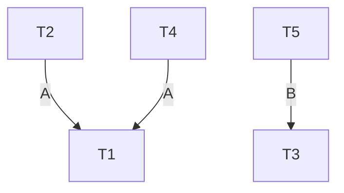

---
aliases:
  - September 2024
tags:
  - PYQ
  - Database
Date: 2025-05-22
Finished Date: 2025-05-22
Completion: true
obsidianUIMode: preview
---
# Section A

## Question 1

### Question A

>[!HINT]- How to answer
>1. *Draw the diagram*
>2. *Talk about what ANSI-SPARC architecture is*
>	1. *Objective*
>3. *Talk about the 3 levels*

---

![[three_level_ansi_sparc_architecture]]

ANSI-SPARC architecture allows users to have their own custom view of the database. Database administrator should be able to make changes to the structure of the database without affecting the external observable view of the database. The physical aspect changes should not change the internal structure of the database. 

External level:
1. User view of the database
2. Each user can have his or her own custom view of the database

Conceptual Level:
1. Community view of the database
2. Describe the type of data that is stored and the relationships between the data

Internal Level:
1. Physical representation of the data
2. Describes how the data is being stored
3. **Dependent on the software that is being used**

### Question B

>[!TIP]- How to answer
>*The way to answer differences is to highlight what the objects are in the first place*
>1. *Base Relation*
>	1. *Stored physically*
>	2. *Corresponds to a named relation in the conceptual schema*
>	3. *The entirety of the relation can be seen*
>		- *Every attribute, metadata, etc can all be seen*
>	4. *The relation can be updatable if the user has the appropriate role and privilege*
>2. *View*
>	1. *Virtual Table*
>	2. *Created from user's request*
>		- *What is shown is dependent on the query*
>	3. *Its updatability is dependent on how the view is created*
>		- *Only simple SELECT*
>		- *No functions, or calculations*
>		- *Only one table*

--- 

*Organised answer*
1. Physical storage and virtual definition
	- Base relations are relation whose tuple is stored physically in storage
	- Views are virtual relations that are created on user request on base relations. No additional data is stored physically. 
2. Updatability
	- Base relations are generally directly updateable given that the user has the appropriate roles and privileges. 
	- Views are often restricted in terms of updateability. Views are only updateable when the query involves simple SELECT statement without functions, calculations, or the query does not involve more than one relations. To update the view, the underlying base relations have to be updated. 
3. Data existence and materialisation
	- Base relations does not exist from queries, but instead provides the data needed to create views. Users interact with base relations to perform operations.
	- Views are generated from user requests on base relations. Without the base relations, views cannot exist

### Question C

>[!HINT]- How to answer
>*Describe what inheritance and specialisation are. Give an example*
>1. *Inheritance*
>	- Property that allows one or more child entities to have the same properties or relationships of a supertype.
>	- The relationship between the subtypes and the supertype is a "kind-of" relationship, where the child entities are more specific entities, while supertypes are the more generic entity
>2. Specialisation is a top-down approach to determine the child entities from the supertype. This method determines the specific child entities that can be derived from the super type. 
>3. Example: Keep it simple and direct. Talk about what they inherit
>	- `Employee` entity as the supertype and `Programmer` as the child type. `Programmer` will inherit properties and relationship from `Employee`, while having its own unique properties and relationships. For example, name, dob, and gender are properties inherited by `Programmer` and a relationship with `Deparment` is also inherited. `Programmer` can have its own unique property, `programming_language`.

---

Inheritance refers to when specific subtypes inherit attributes and relationships from a generate entity type. Two techniques are used to create inheritance relationship, which are specialisation and generalisation. 

An example of inheritance is an `Employee` entity type specialising into `Programmer`, `Janitor`, and `Clerk` type. Each of the subtypes inherit common attributes from `Employee` type such as `EmployeeId`, `Name`, `DOB`, and `Gender`. The subtypes also inherit a relationship from `Employee`; `Employee`'s one-to-many relationship with `Department`. 

The subtypes can have their own unique attributes and relationships too. For example, `Progammer` can have its own unique attribute which is `Programming Language`. 

### Question D

>[!HINT]- How to answer
>*Find keyword: is-a, kind-of, has-a*
>1. *made up of*
>	- This means the relationship is not a generalisation relationship, not composition or aggregation
>2. Find description that fits either of those two
>	- Independent/dependent existence and independent/dependent lifespan
>3. Talk bout why not
>	- The two entities do not share any common attributes that would lead one to be a supertype of another
>	- Independent/dependent lifespan
*Review*

---

This is aggregation, a weak association between the part and the whole. 

This is aggregation because both the part and the whole have independent existence. The car can exist without an engine while the engine can exist without a car. 

Another reason is because of independent lifespan. When the car breaks, the engine is still alive and can be moved to another car. If the engine breaks, the car can take in another engine. This means that the relationship is not a composition relationship. 

The third reason is that both car and engine are separate entity with their own respective attributes and relationship. The engine and car does not share any common attributes and relationships that allow them to have a supertype-subtype relationship. This rules out generalisation. 

Finally, the part, engine, is not exclusively owned by the whole, car. The engine can be moved to another car, which means that this is not a composition association.

## Question 2

### Question A

>[!HINT]- How to answer
>*Consistency rule*
>The relations: Customer and Order. This means that these are related via a foreign key
>1. Talk about the relationship between the two
>2. Talk about referential integrity
>3. Talk about what foreign key is
>	1. Match value
>	2. Nullable
>4. Talk about how it can be enforced
>	1. Cascade update/delete
>	2. Set Null
>	3. Set Default
>	4. No action
>*Relate back to the question!*

---

The relationship between Customer table and Order table is a one-to-many relationship where the customer is the strong entity and order is the weak entity. This means that referential integrity has to be enforced. In Order table, the foreign key must be wholly null or must match a value of the primary key in Customer table. This is important to indicate which order belongs to which customer. **This is also important to ensure that every order belongs to a valid customer**

To ensure this, cascade update or cascade delete can be implemented where deleting or updating a Customer tuple will delete or update the tuples in Order relation that is related to the Customer tuple. Set Null or Set default can also be implemented where deleting a Customer tuple will either fill the related tuple's foreign key with a null value or with a default value. Finally, preventing any actions can be enforced, where a tuple from the Customer relation that is related to one or more tuples in the Oder relation cannot be removed.

### Question B

>[!HINT]- How to answer
>*Relate everything back to the question*
>Observe the transactions. Determine if it has deadlock. Describe what deadlock is based on the transactions in the question. Talk about the flow of locks in the transactions.
> 
>*Describe transactions that requests locks on similar data item*
>*Draw the Wait-For-Graph*

---

No deadlock. This is because there is no two or more transactions that are requesting for locks being held by each other. 

Based on the transactions, T1 holds a lock on data item A; T2 and T4 requests lock on data item A, but they are blocked. T1 is not requesting any lock on data items held by T2 and T4, so there are no deadlocks. T3 holds a lock on data item B, and T5 requests a lock on B. Again, T3 is not requesting exclusive lock on any data item held by T5, so there is no deadlock. Finally, shared lock on a data time would not course deadlock, so T3 and T4 would not be in a deadlock either.   

In the Wait-For-Graph, there is no cycle of requests on lock can be found.

*Draw the Wait-For-Graph*

### Question C

>[!TIP]- How to answer
>This follows ACID
>The basic rule in finding example is:
>1. Pick two operations in the transaction that involves updating value
>	- It can be subtracting
>	- And then adding it else where

--- 

1. Atomicity
	- All or nothing property. This means that all the operations in a transaction is committed or none of them commits. 
	- For example, there is a transaction with an operation to withdraw 50 dollars from Savings account and deposit 50 dollars into Checking account. If an error occurs after the withdraw operation and before the deposit operation, both operations will be roll-backed and the database is not updated.
2. Consistency
	1. Committed transaction has to change the database from one consistent state to another consistent state
	2. When the transaction is successful, the Savings account should have 50 dollars less and the Checking account should have 50 dollars more
3. Isolation
	1. The partial effect of uncommitted transaction is not visible to other transactions.
	2. For example, if another user is executing a transaction to view the total in Savings account and Checking account, the user would only be able to view the amount in Savings and Checking before the first transaction commits or after the first transaction commits. The user will not be able to see a subtract Savings amount and a Check amount that remains the same. 
4. Durability
	1. The effects of a committed transaction should not be lost in the event of a later failure.
	2. For example, after the transaction commits, the new Savings and Checking value should remain updated and not be lost when the database server shuts down unexpectedly.

### Question D

>[!HINT]- How to answer
>
>1. Deferred update
>	1. Timing of update
>	2. What happens at failure
>2. Immediate Update
>	1. Timing of update
>	2. What happens at failure
>3. Shadow Paging
>	1. There's no timing of update
>	2. Nothing much happens at failure
>4. Use of transaction log

---

Differences:
1. Timing of update
	1. Updates are applied only when the transaction commits in deferred update
	2. Updates are applied as the transaction progresses in immediate update
	3. Updates are applied to the database when the current page becomes the new shadow page.
2. Technique used for committed transactions in the event of failure
	1. Roll-forward is applied in deferred update
	2. Roll-forward is applied in immediate update
	3. No technique is applied. The current page is considered to be a valid state when committed. 
3. Technique used for uncommitted transaction in the event of a failure
	1. No technique is applied because no updates have been applied to the database in the first place
	2. Roll-backward because the updates are applied as the transaction progresses. 
	3. No technique is applied. The current page is discarded and the shadow page remains unchanged. A new current page will be created.
4. Use of transaction log
	1. Deferred update uses roll-forward log
	2. Immediate update uses roll-backward log
	3. Shadow paging does not use logs. It switches point to the pages. 

## Question 3

### Question A and Question D

*Review*

*Keep it simple*
1. *Read the passage carefully*
	1. *Each line*
2. *Identify the nouns*
3. *Identify the attributes*
4. *Relationship comes last*

*Gather as much information as possible.*

---

Entities:
1. teams
	1. teams_id
	2. name
	3. main_stadium
	4. city
2. matches
	1. match_id
	2. host_team
	3. guest_team
3. players
	1. player_no
	2. name
	3. dob
	4. start_year
	5. shirt_number
4. players_matches
	1. match_player_id
	2. match_id
	3. goals
	4. red_card
	5. yellow_card
	6. substitute_player_id 
	7. substitute_time
5. referees
	1. referee_id
	2. name
	3. dob
	4. year_exp
	5. match_id

### Question B

teams and players has one to many relationship
teams and matches have one to many relationship (one as host)
teams and matches have one to many relationship (one as guest)
players and matches have many to many relationships
referee and matches have one to many relationships

### Question C

# Section B

## Question 4

### Question B

1. Local DBMS component
	- To manage data at the sites with a database. 
2. Data communication component
	- Allows the different sites to communicate with one another to share data
3. Global system config
	- Contains information about the distributed system
	- Fragmentation, location of each fragments and replication
4. Distributed DBMS
	- The control unit of the distributed system. 

### Question C

1. Performance
	- Global application may require data from multiple fragments that are from multiple different sites
	- This may introduce overhead as processing has to be done to find and join the data together
2. Integrity
	- Integrity control is difficult when data and functional dependency is stored in multiple, separate fragments.
	- The consistency of data in each fragments can be difficult to maintain. For example, if a data is replicated and allocated to different sites and is updated, the update may not propagate to every site due to errors, introducing inconsistency
3. Complexity of data management
	- The DBMS must keep track of how fragmentation is done, where they are allocated, how the fragments are to be reconstructed to create the original data, and handle operations spanning across multiple fragments. 

# Next Paper

[[Past Year Papers/Year 2/Semester 3/Database Technology/May 2024|May 2024]]