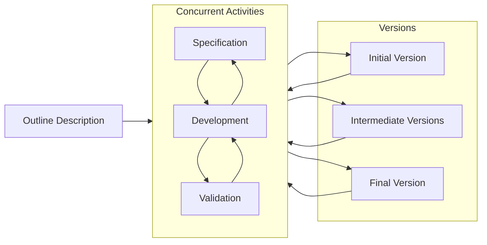

# Section A

## Question I

### Question A (I, II, and III)

Plan-driven approach

1. Cost and frequency of change
	- In plan driven methodology, the cost of changing requirements is high, so it is often limited. This is because the features are often completed before being shown to stakeholders for reviews.
2. Non-functional requirement
	- The autopilot system requires heavy emphasis on low response time and high accuracy, both of which requires thorough research and analysis. These non-functional requirements do not require a lot of user involvement, since the testing are more quantitative than they are qualitative.
3. Software lifetime
	- Such systems are meant to last a long time with a few maintenance throughout its lifetime. With plan-driven approach, a formal documentation would be produced, making maintenance on the system much easier and clearer

Efficiency. The system should be as optimised as possible so that it does not use more resources than it should. This, in turn, would guarantee a better performance. 

Dependability and security. The effectiveness of the system involves the security of the driver and others on the road. Ensuring that the system has a strong cybersecurity is crucial to ensure that no malicious user can tamper with the system.

### Question B

### Question C

1. Higher software quality
	- This is because the components being reused have already been tested and validated to be functional with minimal errors
2. Saving development cost and time
	- Instead of writing the source code from scratch, the developers spend more time choosing and ensuring that the right component is used. 

### Question D

*Did we learn this?*

## Question 2

### Question A

1. Requirements definition
	- The users work with the engineers to determine the requirements for the system
2. Feasibility study
	- Analyse the requirements gathered to determine whether is it possible in terms of technical skills and resources within the budget and time constraint
3. Requirements specification
	- Produce models that outlines the functional and non-functional requirements of the system. May use DFDs, UML diagrams, or class diagrams.

### Question B

#### Question I

Reuse-oriented software engineering. This is because the development of the system involves reusing components from different vendors, which coincides with the principle of reuse-oriented software engineering. 

#### Question II

1. Requirements specification
2. Components analysis
3. Requirement modification
4. System design with reuse 
5. Deployment and integration 
6. System validation

### Question C

Goal: Develop a food ordering feature

List of tasks:
1. As a staff, I want to be able to view the address of the customer who ordered it, so that I can know the demographic of my customer
2. As a staff, I want to be able to modify the menu that is shown in the app, so that I can control what is available based on the currently available resources
3. As a staff, I want to be able to control the prices on the menu, so that I can manage my cash flow
4. As a staff, I want to control the time in which I am open for orders, so that I can stop more orders from flowing in during overwhelming times.

## Question 3

### Question A

1. Component Acquisition
	- This process involves searching for components and listing them. These components are then narrowed down based on the system requirements.
2. Component Management
	- This process is concern with managing stored components; keeping track of their updates and evolution, as well as ensuring that it is ready to use when needed.
3. Component Certification
	- Once the component is considered safe and effective to be used, it would be certified for used. 

### Question B

Abstract factory. In abstract factory, a group of related objects or families of objects can be created. In a GUI framework, there are multiple elements on the page which are related and are dependent on one another. For example, Button class can have NagivationButton, ConfirmationButton, ClearButton, or ResetButton. 

### Question C

Architectural patterns describes how the system is to be built while design pattern refers to reusable solutions that can be reused to fixed recurring problems. The problems that each of them solve are different. For example, architecture pattern aims to provide a framework such as MVC, Layered, and microservice architectures for developers to follow when developing a system while design pattern aims to streamline developing certain features - developing a notification feature uses the observer behavioural design pattern.  

### Question D

#### Question I

Encryption of the message should use a microservice architectural pattern. In microservice architecture, the system is built from multiple, smaller, independent services, each providing a specific service. This allows for a more granular control over the security such as encrypting the messages even further when the different services communicate with each other. 

For Web metric, the model-view-controller architecture can be used. In mode-view-controller architecture, different views can be used on the same models, allowing for different types of analytics to be created. 

#### Question II

1. Database
	- Each microservice can have a database that scales independently
2. Message broker
	- To allow asynchronous communication
3. Microservices
	- The components that provide services
4. API gateway
	- To allow the different components to communicate with one another.

# Section B

## Question 4

### Question A

|                |                                 |                  |
| -------------- | ------------------------------- | ---------------- |
| Below 111AMG-A | Between 111AMG-A and 79201AMG-G | Above 79201AMG-G |

Valid test cases:

1. The middle alphabetical "AMG" must be sequential and case sensitive

Invalid test cases:

1. The alphabets are not in alphabetical order: \[MAG, GAM, MGA]
2. The alphabets are not all in capital letters: \[amg, Amg, AMg]
3. It contains numerical value: \[A1MG, A3MG, A6MG]
4. The string values have less than 3 alphabets: \[A, B, AB]
5. The string values ~~explodes~~ have more than 3 alphabets: \[HELP, PLSS]

### Question B

1. Incompatible interface
	- The components being reused may have incompatible interfaces compared to the components that are already being used in the system, making integration difficult.
2. Conflict and dependency issue
	- The different components may be using frameworks or libraries of different versions. 
3. Does not fulfill the requirements
	- Some components may not be able to fulfill the user requirements, forcing compromise in the system's requirements
4. Security issue
	- If not checked thoroughly, the component may have code that will expose the company to vulnerability or open unintentional backdoor.
5. Loss of autonomy
	- If the reusable component is from a third party organisation, the company would not be able to control the evolution or the changes made to the component

### Question C

1. COTS product refer to products that are created by companies and are meant to be usable out of the box without much configuration and can be adapted to the needs of different customer without changing the source code of the system.

2. COTS-integrated system is more appropriate. This is because, in this case, there is already an existing system an there are multiple COTS products that will be used. This is also supported by the fact that one COTS product is not enough to fulfill my requirements. 
3. Loss of autonomy
	- Since COTS products are developed by a third part company, there is no control over the evolution of the software. 
4. May not fulfill my requirements
	- Although COTS products are meant to be easily adaptable, because they are proprietary, I cannot modify the source codes to add or remove features to fulfill my requirements

## Question 5

### Question A

*Same as above*

### Question B

1. When the cost of maintenance is too high
	- If the cost of maintenance is too high, it should be replaced with a new, more optimised, and readable counterpart
2. When the competitor has a better system, or the market has changed
	- When the legacy system's features is unable to keep up with the changing market and changing the system would cost too much, discarding it and replacing it would be the better approach. 

### Question C

GitHub would first check if the configuration item is already on the developer's private workspace. If it is, it would check whether the configuration item is the latest version. If not, it would request the developer to pull the latest version. While it pulls, it would check if the developer's current version conflicts with the new version. If there is no conflict, the developer has successfully pulled the configuration item

### Question D

Risk monitoring is the act of making observations of the system after the actions in response of a risk has been carried out. This involves observing the performance of the system, functionalities of existing or affected features, or it can also involve the process of software development. 

*Basically, what would raise concern?*
Estimation
1. Failure to meet the created schedule 
2. Failure to keep within the constraints of the budget

People
1. Demotivated staffs
2. A lot of staffs quit (turnover)

Requirement
1. Ambiguous requirements
2. Requirements keep changing
