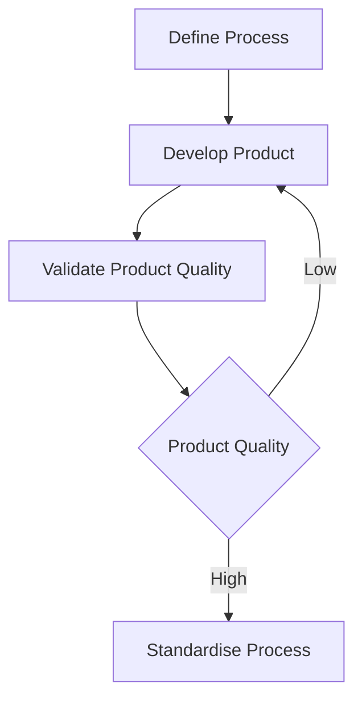
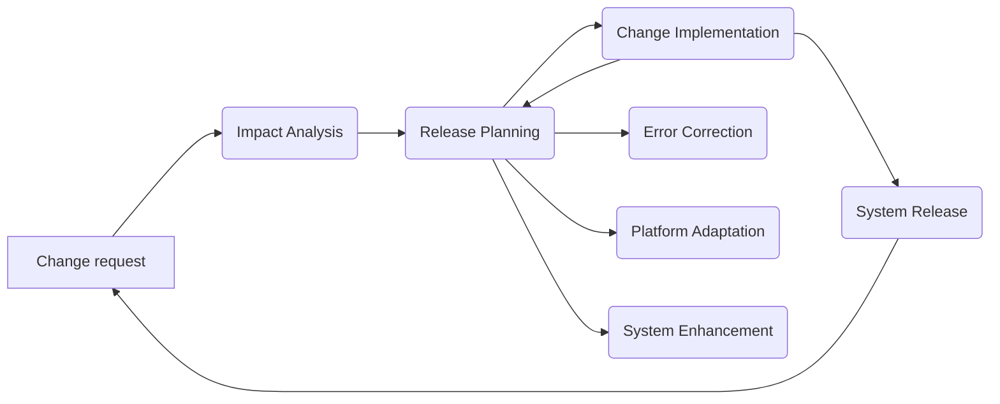

# Section A

## Question 1

### Question A

1. So that the project stay within the allocated budget
	- It is important to keep spending in check so that the finances of the organisation does not get negatively affected
2. So that the system created matches the user requirements
	- Planning is important to ensure product quality and user is satisfied with the deliverable
3. So that the system does not take too long to create
	- This is necessary to keep customer's trust and prevent the company from focusing on projects that do not provide positive, tangible outcome.
4. To ensure that the process of development is structured and planned
	- A good process quality would create a high quality product

### Question B

1. Agile. This is not a critical system
2. Agile. Users' feedback is important
3. Plan-driven. This is a software where user feedback does not play much of a role
4. Agile. User involvement is crucial in determining the content aimed for users
5. Plan driven. This is a crucial system 

### Question C

1. Schedule daily scrum
2. Track progress against work backlog
3. Protect the development team from distractions
4. Write down decisions made in daily scrum
5. Communicate with customers and stakeholders
6. Keep track of work done in the work-backlog
7. Ensure the scrum process is followed

## Question 2

### Question A

#### Question I

*I drew it already*

#### Question II

MVC $\rightarrow$ separates presentation and interaction from the system data

Model $\rightarrow$ Responsible for the system data and the operations associated with the data

View $\rightarrow$ Responsible for the format in which the data is presented to the user

Controller $\rightarrow$ Responsible get user interaction and passing information to model and view

### Question B

1. Modularity and re-usability
	- The nature of this architecture emphasises on modularity, making re-using components from other systems or re-using views on different models or re-using models on different views easy.
	- This can save development time and cost, as each of the component can be copied, removing the need to build the components from scratch.
2. Durability
	- Because of the modularity, the system can also be said to be durable. This is because when one component malfunctions, it does not affect the functionality of other components.
	- This durability allows the system, as a whole, to keep function even when one of the component is down. 
	- This also 
3. Ease of maintenance
	- The clear separation of certain also allows easier maintenance, as it makes it easier to pinpoint the exact cause of the bugs and errors
	- This can save developers a lot of time, because instead of combing through hundreds of lines of code, they can easily hop to any of the component and find out from there.
4. Parallel development
	- The modular nature of makes the components independent, allowing multiple developers to develop multiple components at the same time. 
	- This can speed up development exponentially. 

## Question 3

### Question A

1. **D**ocumented
	- Each of the components should be properly documented
	- Details of the functionality of the component, the algorithms used, and its dependencies should be highlighted clearly
2. **I**ndependent
	- The component should be independent and is able to function without depending on the services of other components.
	- If the component does depend on the services provided by other components, it should be highlighted clearly
3. **S**tandardised
	- The components should conform to a set of standards
	- This refers to the component interface, metadata, documentation, or deployment
4. **C**omposable
	- The components should be able to be used to compose a large system.
	- For a component to be able to be part of a composition, all external interactions should happen over a publicly defined interface. The component should also provide an access point to information about itself (attributes and methods)
5. **D**eployable
	- The component should be able to be deployed as a standalone entity on a component platform that provides an implementation of the component

#### Question I

1. **I**ndependent
	- The component should be independent and is able to function without depending on the services of other components.
	- If the component does depend on the services provided by other components, it should be highlighted clearly
2. **S**tandardised
	- The components should conform to a set of standards
	- This refers to the component interface, metadata, documentation, or deployment.

## Question B

## Question C

Waterfall model is a plan-driven model that has heavy emphasis on structure.

1. Not flexible to changing requirements
	- Once the requirements of the system has been confirmed, changing it is often costly and not recommended
	- Once the requirements are confirmed, it has been locked in.
2. Low customer involvement
	- Customer is usually only involved in the requirements definition phase.
	- This means that in other phases, customer feedback is difficult to get or sometimes does not exist. 
3. Long time between phases in waterfall model
	- This can be dissatisfying to the stakeholders and customers as they are deprived of a tangible deliverable. 
	- This may lead them to question the efficacy of the development team.

# Section B

## Question 4

### Question A

#### Question I

1. Not too old 
2. Not too young
3. Is a positive number
4. Is an integer

#### Question II

Valid test cases:
1. Ages within range: \[20, 30, 40]
2. Ages that are positive: \[20, 30, 40]
3. Ages that are integer: \[20, 30, 40]

Invalid test case
1. Ages out of range: \[70, 10, 90]
2. Ages that are negative: \[-20, -30, -40]
3. Ages that have floating points: \[20.75, 3.0, 4.50]

### Question B

1. User authentication and authorisation when logging into his or her account.
2. Viewing information about courses
3. Downloading courses information such as lectures notes 
4. Updating course information in the system

### Question C

## Question 5

### Question A

#### Question I

1. Change request
2. Impact analysis
3. Release planning
4. Change implementation
5. System release
6. Error correction
7. System enhancement
8. Platform adaptation

#### Question II

### Question B
SSAABB

1. System hardware. The hardware is no longer being developed
2. Application system. The languages used in the application models is no longer maintained
3. Software support. The supporting software in which the system depends on is no longer supported
4. Application data. The data being managed by the application system is inconsistent, duplicated, or stored in multiple databases.

### Question C

1. Identification
	- Identify configuration items
	- Components that needs to be changed
2. Control
	- Changes made to the configuration items should be structured
3. Status accounting
	- Keep track of the configuration items and changes in state
4. Verification and auditing
	- Ensures that the configuration is correct and meets requirements.

# Next Paper

[[Past Year Papers/Year 2/Semester 3/Software Engineering Principles/September 2023|September 2023]]