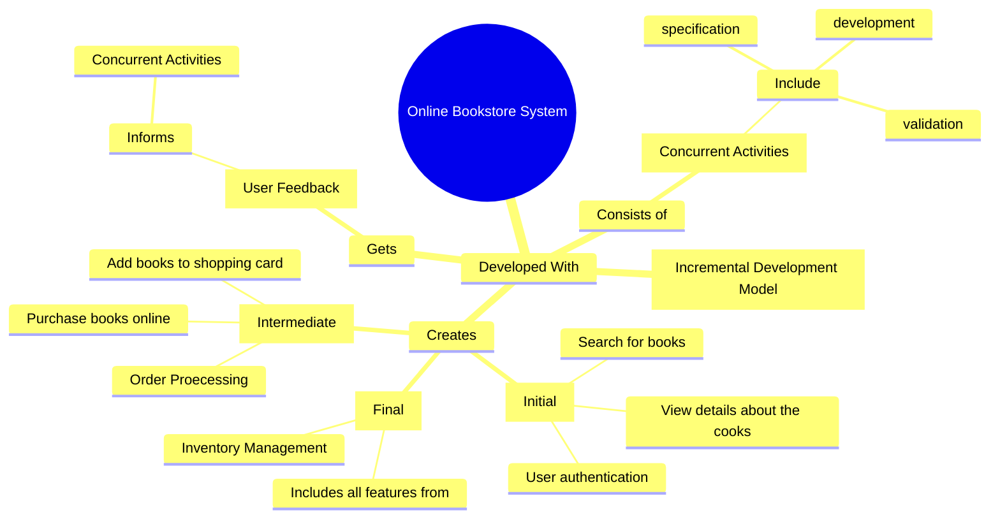

# Section A
## Question 1
### Question A

#### Question I

1. User should be able to search for books from a vast catalogue to let them quickly find the books that they want.
2. User should be able to view details about the books such as price, synopsis, and blurb.
3. User should be able to add books to a shopping cart to keep track of their wanted books.

#### Question II

1. The transaction should be secure and does not expose the user to cyber attacks to protect the user
2. The online bookstore should be responsive and loads with less than 3 seconds to ensure that the user feels acknowledged.
3. The user interface of the website should be attractive and visually appealing to keep them invested. 

### Question B

### Question C

Benefits
1. Saves time
	1. A lot of time is saved from needing to rewrite a lot of code
2. Higher quality
	1. The reusable components have already been tested and approved to be used, allowing testing efforts to be placed at other parts of the software. 

Challenges
1. May not fulfil the requirements
	- Developers or users would have to compromise on the requirements
2. Loss of control
	- The developers does not have control over the evolution of the reusable component which would impact the software being developed if the component does not evolve in the desirable direction

## Question 2

### Question A

1. Product Manager
	- Determine project goal 
	- Prioritise task based on business value
2. Scrum Master
	- Ensure that the scrum processed is being followed
	- Protect development team from distractions and harm
	- Communicate with customers and managers
	- Hold daily scrum
	- Record decision made in daily scrum
	- Compare progress against the work backlog
3. Development team
	- The team that will develop the system

### Question B

#### Question I

*Backlog is essentially a record of tasks to be done. *

1. User stories
2. Task
3. Assignees
4. Estimated time and actual time

#### Question II

A sprint backlog is created at the start of every sprint to highlight the task to be done throughout the sprint. In every sprint backlog, there would be user stories which will be the main focus of the sprint. This means that every task for that sprint will be revolved around the user stories that are chosen. Each user stories may have multiple tasks to be finished in order to implement the user story. And each task can be subtasks. The division of user stories into tasks and subtasks is to facilitate development by reducing the complexity. Each tasks and subtasks are also assigned to individuals in the development team. For each task, there will be an estimated time of completion and the actual time it took to complete the task. This is necessary to keep track of the development's progress and activity. 

### Question C

#### Question I

1. As a user I want to be able to search for desired airline tickets
2. As a user I want to be able to receive notification for the travel date and time
3. As a user I want to be able to filter the airline tickets based on my preferences
4. As a user I want to be able to book the airline ticket that I want
5. As a user, I want to be able to purchase the airline ticket

## Question 3

### Question A
*Architectures:*
1. *MVC*
2. *Layered*
3. *Microservice*
4. *Client server*
5. *Repository*

### Question B
#### Question I

MVC. 

1. There are a multiple views
	- This can be observed with the need to present different charts of raw data.
	- Since each student would have different assessment results, but each of them would be presented with the same charts, the views can be used on multiple models. 
2. Changing requirements
	- This model is flexible because of the clear separation of concern between Model, View, and Controller.
	- When a teacher wants to add a new chart, a new view can be added without affecting any of the current models.

#### Question II

1. Model
	- Handles the system data and the related operations
2. View
	- Handles how the data is presented to the user
3. Controller
	- Handles user interaction and passes information to view and model.

### Question C

1. Compatibility issue
	- The different components may use different interfaces which require adapters to be developed to allow the components to communicate with each other.
2. Data format inconsistency
	- The component's output data format may not be supported by another component. 
	- Translation would have to be done to change the data format to be supported.
3. Security issue
	- Some components may have vulnerability which may affect the whole system.

# Section B
## Question 4

### Question A

#### Question I

COTS products are products that are developed with other companies and are able to be purchased and readily used or integrated in one's system. 

#### Question II

Application reuse. Application reuse involves reusing applications with or without any changes. By reusing applications instead of reusing system, the company is given greater flexibility in customising the system by being able to customised reusable applications. This is faster than building components from scratch and less rigid than using an entire system. Function or object reuse is less appropriate because unlike application reuse, a lot of coding still have to be done, since function or object reuse reuses specific component that does a singular, small function. 

### Question III

1. Less flexible
	- COTS products are often proprietary, meaning, unlike open-source projects, these products' source codes cannot be customised, disallowing the developers to tweak the product
2. Security
	- By using COTS products, the company is risking exposure of private data to a third-party company.
	- The COTS products may also be vulnerable to attacks and the company who purchased it has no control
3. Compatibility issue
	- Version mismatches
	- Interface mistmatch
	- Data mismatch

### Question B

COTS components are often tested through rigorous testing. This means that the quality of the COTS components are of high quality and can be trusted, saving costs on maintenance. With COTS, often times, they are developed to be general enough to be able to adapt to different companies' requirements. This makes it easier for companies to add COTS into their existing system, thereby making the growth of the software much easier and quicker.

### Question C

1. Maintenance Request
	- This is necessary to determine if the maintenance tasks should be prioritised or can be on the waitlist
	- This is also important to determine if the maintenance is urgent and has to be done immediately
2. Impact Analysis
	- Each request has to be analysed based on the impact that they might have on the system if they are implemented. 
	- This is necessary to ensure that the system remains functional after the change has been implemented
3. Version Control
	- This is important to ensure that there is a baseline to roll-back to when the implemented maintenance request fails.
4. Testing and Validation
	- Tests the system after the maintenance has been implemented and validate if it meets the request's requirements
5. Monitoring and post maintenance review
	- Monitor the status of the system after the maintenance has been implemented.

# Next Paper
[[Past Year Papers/Year 2/Semester 3/Software Engineering Principles/May 2024|May 2024]]