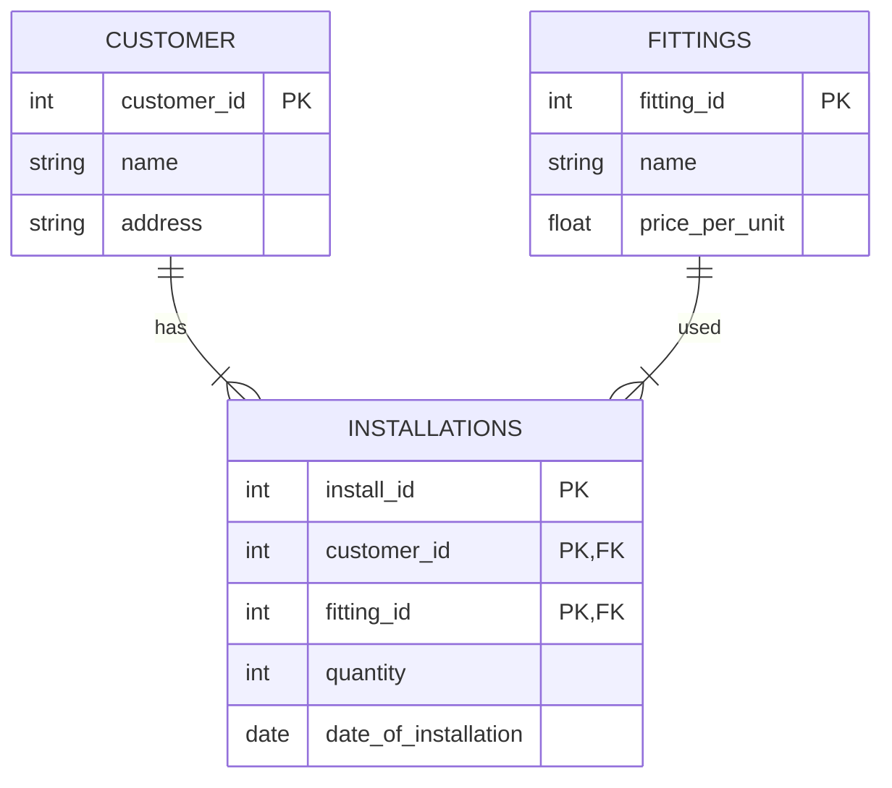
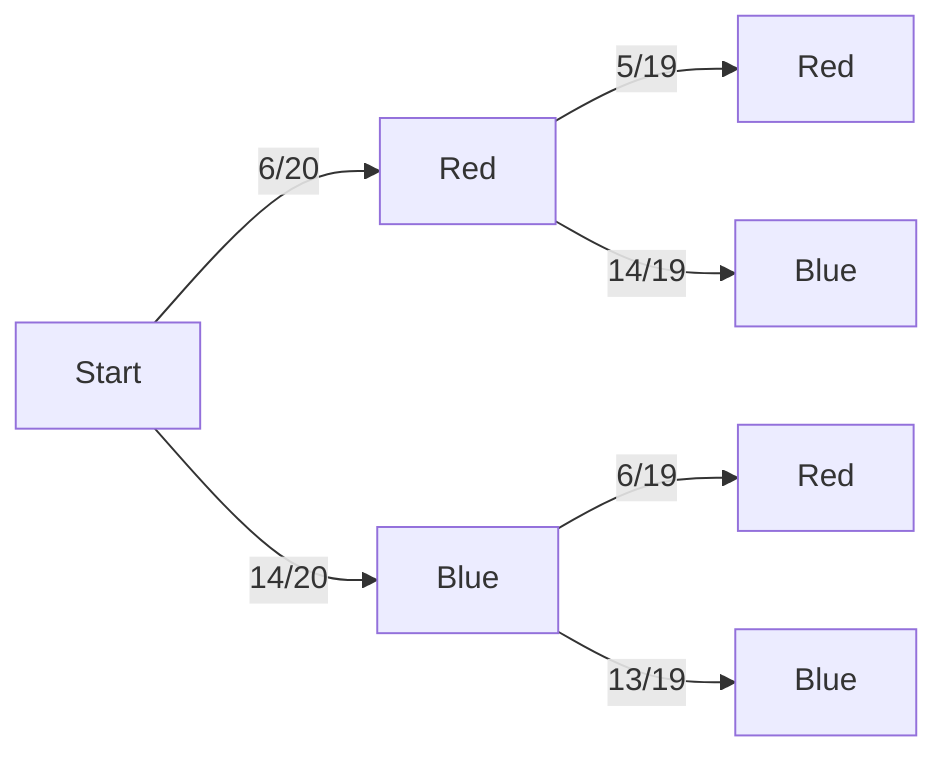

---
aliases:
  - May 2024
tags:
  - PYQ
Date: 2025-09-17
Finished Date: 2025-09-17
Completion: true
obsidianUIMode: preview
---
# Section A

## Question 1

### Question A

#### Question I

1. Customers
2. Fittings
3. Installations

#### Question II

*You don't need the data type for logical model*

#### Question III

*Datatype has been defined in [[Past Year Papers/Year 3/Semester 1/Data Science/May 2024#Question II|Question II]]*

Constraints:
1. Customers
	- customer_id 
		- Unique and not null
	- name
		- Not null
2. Installations
	- install_id
		- Unique and not null
	- customer_id
		- Not null
	- fitting_id 
		- Not null
	- quantity
		- Not null
	- date_of_installation
		- Not null
3. Fittings
	- fitting_id
		- Unique and not null
	- name
		- Not null
	- price_per_unit
		- Not null

### Question B

0, 0.25, 0.28, 0.66, 1.41, 1.65, 1.81, 2

#### Question I

Range = 2

#### Question II
$$
\begin{align}
z &= (b - a) * \frac{x - \text{min}}{\text{max} - \text{min}} + a\\
z &= (2 - 0) * \frac{x + 67}{69 + 67} + 0 \\
z &= \frac{2(x + 67)}{136} \\
z &= \frac{x + 67}{68} \\
68z - 67 &= x
\end{align}
$$

| z   | 0   | 0.25 | 0.28 | 0.66 | 1.41 | 1.65 | 1.81 | 2   |
| --- | --- | ---- | ---- | ---- | ---- | ---- | ---- | --- |
| x   | -67 | -50  | -48  | -22  | 29   | 45   | 56   | 69  |

## Question 2

### Question A

$\mu = 100, \; \sigma = 40, \; n_{\bar{x}} = 50, \; \bar{x} = 90$

#### Question I

$$
\begin{align}
\text{SE}_{\bar{x}} &= \frac{\sigma}{\sqrt{ n }} \\
&= \frac{40}{\sqrt{ 50 }} \\
&= 5.6569
\end{align}
$$

$$
\begin{align}
z &= \frac{\bar{x} - \mu}{SE_{\bar{x}}}  \\
&= \frac{90 - 100}{\frac{40}{\sqrt{ 50 }}} \\
&= -1.77
\end{align}
$$

#### Question II

$\text{p-value (one-tailed)} = 0.0384$

$\text{p-value(two-tailed)} = 0.0768$

#### Question III

$$
\begin{align}
\text{CI} &= \bar{x} \pm z * SE_{\bar{x}} \\
\text{Upper} &= 90 + 1.96 \times \frac{40}{\sqrt{ 50 }} \\
&= 101 \\
\text{Upper} &= 90 - 1.96 \times \frac{40}{\sqrt{ 50 }} \\
&= 79 \\
\end{align}
$$

### Question B

No. p-value, 0.0768, is greater than the significance level, 0.025. Based on significance level, the sample mean, 90, falls within the upper and lower bound (79 - 101), so the null hypothesis can't be rejected

### Question C

1. False positive (type 1 error)
	- Incorrectly reject null hypothesis and accepting the alternate hypothesis
	- This can be reduced by using a higher significance level
2. False negative (type 2 error)
	- Incorrectly accept the null hypothesis and accepting the alternate hypothesis
	- Can be resolved by repeating the hypothesis testing with more sample data.

### Question D

Probability = 

$$
\begin{align}
P(D) &= P(R,B) + P(B, R) \\
&= \left( \frac{6}{20} \times \frac{14}{19} \right) + \left( \frac{14}{20} \times \frac{6}{19} \right) \\
&= \frac{42}{95} \\
&= 0.44 
\end{align}
$$
## Question 3

### Question A

#### Question I

$$
\begin{align}
R &= \frac{p \sum{xy} - \sum{x}\sum{y}}{\sqrt{\left( p \sum{x^2} - \left( \sum{x} \right)^2 \right) - \left( p\sum {y}^2 - \left( \sum{y} \right)^2 \right)}} \\
R &= \frac{6 \times 436, 065 - 1610 \times 1677}{\sqrt{\left( 6 \times 435,054 - \left( 1610\right)^2 \right) - \left( 6 \times 542207 - \left( 1677 \right)^2 \right)}} \\ \\
R &= -0.9324
\end{align}
$$

#### Question II

A Pearson's correlation coefficient of -0.9324 indicates a strong negative linear relationship between duration of sunshine and amount of rainfall. This means that as the hours of sunshine increases, the volume of rainfall in mm will decrease. 

### Question B

It is a mining technique used to find associations between attributes in a database. It measures the likelihood of an object, antecedent, to cause the appearance of another object, consequent. 

The main ways to measure association is with: 
1. support
	- The minimum percentage instances in the database that contain all the items listed in the association rule 
2. confidence 
	- Conditional probability where B is true, when A is true in a A $\rightarrow$ B

### Question C

Association rule: $\{\text{Bread}, \text{Durian}\} \rightarrow \{\text{Peanut}\}$

**Support**

| Item                                                            | Frequency | Support                |
| --------------------------------------------------------------- | --------- | ---------------------- |
| $\{\text{Bread}, \text{Durian}\} \rightarrow \{\text{Peanut}\}$ | 3         | $\frac{3}{7} = 0.4286$ |
| $\{\text{Bread}, \text{Durian}\}$                               | 4         | $\frac{4}{7} = 0.5714$ |
| $\{\text{Peanut}\}$                                             | 6         | $\frac{6}{7} = 0.8571$ |

**Confidence**

| Item                                                            | Support | Support (LHS) | Confidence           |
| --------------------------------------------------------------- | ------- | ------------- | -------------------- |
| $\{\text{Bread}, \text{Durian}\} \rightarrow \{\text{Peanut}\}$ | 3       | 4             | $\frac{3}{4} = 0.75$ |

**Lift**

| Item                                                            | Confidence | Support (Peanut) | Lift                           |
| --------------------------------------------------------------- | ---------- | ---------------- | ------------------------------ |
| $\{\text{Bread}, \text{Durian}\} \rightarrow \{\text{Peanut}\}$ | 0.75       | 0.8571           | $\frac{0.75}{0.8571} = 0.8750$ |
# Section B
## Question 4

### Question A

$9100_{\text{not spam}} + 900_{{\text{spam}}} = 10, 000$

### Question B

Positive = Spam
Negative = Not spam

### Question C

Baseline = 
$$\begin{align}
\frac{9100}{10,000} = 0.91
\end{align}$$

### Question D

| Metrics           | Values |
| ----------------- | ------ |
| Misclassification | 0.05   |
| Precision         | 0.83   |
| Recall            | 0.56   |
| $F_{1}$ score     | 0.67   |

### Question E

No. Although the accuracy, 0.95, exceeds the baseline performance, the correct predictions are concentrated in the not spam class. The model also has a precision of 0.83, meaning that when the model predicts spam, it is correct 83% of the time. However, the model has a low recall value, 0.56, indicating the model correctly identified only slightly more than half of the actual spam messages.

Additionally, the $F_{1}$ score is also low, 0.67, indicating poor harmonic mean between precision and recall. $F_{1}$ score is an important metric in datasets with imbalance classes such as this; a low $F_{1}$ score indicates that the model is biased towards the majority class, not spam, which is not the purpose of the model.  

### Question F

1. Use an unequal cost model
	- This is efficient in creating a model trained on imbalanced dataset where the model would be punished for misclassifying the minority class.
	- A higher cost can be given to wrong prediction of the minority class, improving sensitivity to the class
2. Add synthetic data
	- Since the dataset is imbalanced, the model may favour the majority class. 
	- Adding synthetic data for the minority class allows more training data for the model to learn patterns associated with the minority class, thus improving performance.
	- This can be done with SMOTE

## Question 5

### Question A

$4900_{\text{not spam}} + 1100_{\text{spam}}= 6000$

### Question B

Positive = Spam
Negative = Not spam

### Question C

$$
\begin{align}
\text{Baseline} &= \frac{4900}{6000} \\
&= 0.82
\end{align}
$$

### Question D

#### Question I

$$
\begin{align}
\text{Accuracy} &= \frac{5440}{6000} \\
&= 0.91
\end{align}
$$

#### Question II

$$
\begin{align}
\text{Cost} &= 100 \times 500 + 640 \times -1,500  \\
&= -910, 000 \\
\text{Profit} &= -(\frac{-910,000}{6,000}) \\
&= 151.67
\end{align}
$$

### Question E

Yes. With unequal cost of TP and FP, the accuracy of the model, 0.91, exceeds the baseline performance, 0.82, indicating that the model is capable of correctly predicting classes. Additionally, the model's profit per second is high, 151.67 per second, indicating strong business value.  

### Question F
$$
\begin{align}
\text{Cost} &= 100 \times 500 + 640 \times -750  \\
&= -430, 000 \\
\end{align}
$$
$$\begin{align}
\text{Profit} &= - (\frac{-430,000}{6, 000})\\
&= 71.67
\end{align}$$

No, the model's profit per second has dropped from 151.67 to 71.67. Although the classification of the model exceeds the baseline performance, the financial return of the model has weakened. If the company's goal is to maximise profit, this model may not be able to justify the operational costs and risks associated. 

# Next Paper
[[Past Year Papers/Year 3/Semester 1/Data Science/September 2023|September 2023]]