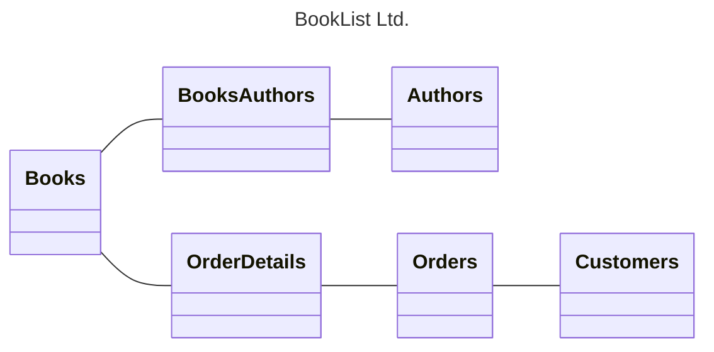
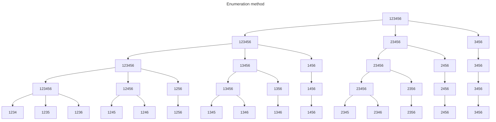

---
aliases:
  - DS May 2025
tags:
  - PYQ
Date: 2025-09-12
Finished Date: 2025-09-12
Completion: true
obsidianUIMode: preview
---
# Section A

## Question 1

### Question A

#### Question I

#### Question II

Relational database

#### Question III

CAP Model. This model is used to build database systems in distributed environments. The properties of this theorem is: 

1. Consistency
	- All nodes that read from the database will get the latest data. 
2. Availability
	- All nodes is always available even when there is partition
	- The ability to read and write is always operational
3. Partition Tolerance
	- Ability to continue operating even when some parts of the database is non-functional. 

In the CAP model, implementing all three properties is not possible, so depending on the situation, a combination of two properties is made. 

1. Consistency and Availability
	- All nodes will have the latest data, and is always available for reading and writing, but will fail under network partition. 
2. Consistency and Partition Tolerance
	- Data is always up to date and consistent, but may not be accessible during partitions (some requests may be denied).
3. Availability and Partition Tolerance
	- Data is always accessible and can tolerate partitions, but sometimes inconsistent. 

### Question B
#### Question I

$$
\begin{align}
\parallel A \parallel & = \sqrt{ 1^2+3^2+5^2 } \\
& = \sqrt{ 1+9+25 } \\
&= \sqrt{ 35 } \\
\parallel B \parallel & = \sqrt{ 2^2+5^2+6^2 } \\
& = \sqrt{ 4+25+36 } \\
&= \sqrt{ 65 } \\
\parallel C \parallel & = \sqrt{ 3^2+5^2+6^2 } \\
& = \sqrt{ 9+25+36 } \\
&= \sqrt{ 70 } \\
C \cdot A &= 3(1) + 5(3) + 6(5)  \\
&= 48 \\
C \cdot B &= 3(2) + 5(5) + 6(6)  \\
&= 67
\end{align}
$$
$$
\begin{align}
\text{Cosine}_{C \cdot A} &= \frac{C \cdot A}{\parallel C\parallel \times \parallel A \parallel} \\
&= \frac{48}{\sqrt{ 70 } \times \sqrt{ 35 }} \\
&= \frac{48}{\sqrt{ 2450 }} \\
&= 0.970 \\ \\

\text{Cosine}_{C \cdot B} &= \frac{67}{\sqrt{ 70 } \times \sqrt{ 65 }} \\
&= \frac{67}{\sqrt{ 4500 }} \\
&= 0.993
\end{align}
$$

#### Question II

Vector B

## Question 2

### Question A

$H_{0}$ = Recovery takes 10 days
$H_{\alpha}$ = Recovery does not take 10 days

$H_{0} = 10 \text{ days}$
$H_{\alpha} \neq 10 \text{ days}$

### Question B

#### Question I

>*Since the number of sample is 7 patients*

student t-test/ t-test.

#### Question II

$$
\begin{align}
t &= \frac{\bar{x} - \mu }{\frac{s}{\sqrt{ n }}} \\
&= \frac{9.14 - 10 }{\frac{2}{\sqrt{ 7 }}} \\
&= -1.138
\end{align}
$$
#### Question III

$\text{dof} = 6$

$\text{p-value} = 0.3$

### Question C

No. $\text{p-value}$ is greater than the significance level ($> 0.05$)

### Question D

#### Question I
Normal distribution test

#### Question II

$$\begin{align}
SE &= \frac{\sigma}{\sqrt{ n }}  \\
& = \frac{5}{\sqrt{ 300 }} \\
&= 0.2887
\end{align}$$
$$\begin{align}
Z &= \frac{\bar{x} - \mu }{SE_{\bar{x}}} \\
&= \frac{9.14 - 10 }{\frac{5}{\sqrt{ 300 }}} \\
&= -2.978
\end{align}$$

#### Question III

$\text{p-value} = 0.0014$

#### Question IV

$$\begin{align}
\text{CI}&=\bar{x}\pm z \times SE \\
&=9.14\pm 1.96 \times 0.289 
\end{align}$$

$$\begin{align}
\text{Upper} &=9.14 +  1.96 \times \frac{5}{\sqrt{ 300 }} \\
&= 9.706
\end{align}$$
$$\begin{align}
\text{Upper} &=9.14 -  1.96 \times \frac{5}{\sqrt{ 300 }} \\
&= 8.574
\end{align}$$
### Question E

No. The $\text{p-value}$ is lesser than the significance level. Additionally, based on the significance level the average recovery days with the new medication, 9.14, falls within the upper and lower while the average recovery days is 10 days, which exceeds the range of values. Therefore, we cannot reject null hypothesis. 

## Question 3

### Question A

#### Question I

${}^{6}C_{4} = 15$ total number of possible item sets

#### Question II

### Question B

#### Question I

X

#### Question II

O

#### Question III

*Bias: The difference between the predictions by the model and the actual values*
*Variance: The variability of predictions made by the model across multiple samples*

Bias refers to the difference between the predictions made by the model and the actual values in the data. With a higher k, more data points will be taken into consideration when determining the class of a data point. If there are more data points from the incorrect class within the vicinity of the unknown data point, the model will misclassify the datapoint. 

However, raising k would result in a decrease in variance. Variance refers to the variability of the predictions made by the model across multiple samples. Larger k reduces variance because predictions become more stable as the same neighbours are likely to be chosen, making the model less sensitive to noise. 

Thus, raising k would result an increase in bias and a decrease in variance. 

# Section B

## Question 4

### Question A

TP = Correctly predicted faulty chips
TN = Correctly predicted working chips

FP = Incorrectly predicted faulty chips
FN = Incorrectly predicted working chips

### Question B

Model A

|            | **Predicted** |        |
| ---------- | ------------- | ------ |
| **Actual** | Working       | Faulty |
| Working    | 3000          | 1500   |
| Faulty     | 50            | 450    |

Model B

|            | **Predicted** |        |
| ---------- | ------------- | ------ |
| **Actual** | Working       | Faulty |
| Working    | 2900          | 1600   |
| Faulty     | 0             | 500    |

### Question C

$$
\begin{align}
\text{Accuracy} &= \frac{TP + TN}{N} \\ \\

\text{Recall} &= \frac{TP}{TP + FN} \\ \\

\text{Precision} &= \frac{TP}{TP + FP} \\ \\

\text{Specificity} &= \frac{TN}{TN + FP}
\end{align}$$

|                    | Model A | Model B |
| ------------------ | ------- | ------- |
| Accuracy           | 0.69    | 0.68    |
| Recall/Sensitivity | 0.90    | 1.00    |
| Precision          | 0.23    | 0.24    |
| Specificity        | 0.67    | 0.64    |

### Question D

*Both models are bad, but we can't say that*

Model B. This is because the model has a perfect recall, allowing it to capture all faulty semiconductors. High recall because critical machines such as MRI rely on semiconductor chips, and if they fail, it would result in catastrophic consequences. Although the precision of the model is low, the cost of misclassifying faulty chips outweighs the cost of misclassifying working chips - they only require additional inspection.

## Question 5

### Question a

Positive = has cancer
Negative = healthy

### Question B

$$
\begin{align}
\text{Baseline} &= \frac{1500}{2000} \\
&= 0.75
\end{align}
$$

### Question C

*Link to the question*

Recall. This is used to measure the ability of the model to predict the positives classes. It's important when the consequences of false negatives are costly, such as cancer patients are not provided with proper treatment

Precision. This is used to measure the accuracy of the model's positive classes predictions. It's important when false positives are costly, such as unnecessary additional health inspections. 

$\text{F}_{1}$. This is harmonic mean between precision and recall. This is useful when the dataset is imbalanced, such as when there are more non-cancer instances than with cancer. 

### Question D

$$
\begin{align}
\text{F}_{1} = \frac{2\times \text{Recall} \times \text{Precision}}{\text{Recall} + \text{Precision}}
\end{align}
$$

|                      | **Model A** |        |     | Model B |        |
| -------------------- | ----------- | ------ | --- | ------- | ------ |
| **Actual/Predicted** | Healty      | Cancer |     | Healthy | Cancer |
| Healthy              | 1350        | 150    |     | 1450    | 50     |
| Cancer               | 50          | 450    |     | 100     | 400    |

|                    | Model A | Model B | Superior model |
| ------------------ | ------- | ------- | -------------- |
| Accuracy           | 0.90    | 0.93    | B              |
| Recall/Sensitivity | 0.90    | 0.80    | A              |
| Precision          | 0.75    | 0.89    | B              |
| $F_{1}$            | 0.82    | 0.84    | B              |

### Question E

Model A. This is because the model achieved a higher recall. Misclassifying cancer patients as healthy will bring heavy consequences; the patients will not get the appropriate treatment and it will cost their lives. Although, the model has a lower precision, misdiagnosis healthy patients with cancer can easily be resolved with additional health inspection, which is a far smaller cost than missing a true case.   

# Next Paper
[[Past Year Papers/Year 3/Semester 1/Data Science/September 2024|September 2024]]