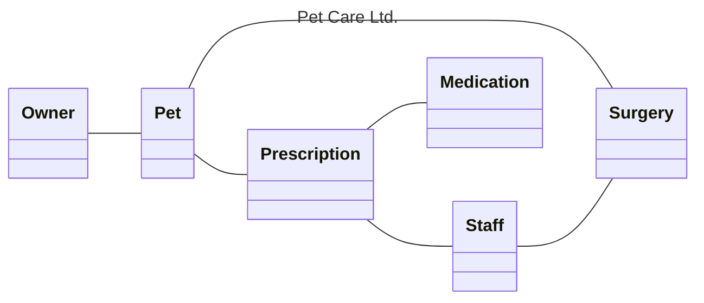

---
aliases:
  - September 2024
tags:
  - PYQ
Date: 2025-09-13
Finished Date: 2025-09-13
Completion: true
obsidianUIMode: preview
---
# Section A

## Question 1

### Question A

#### Question I

#### Question II

| Table        | Primary Key          | Foreign Key                |
| ------------ | -------------------- | -------------------------- |
| Owner        | ownerNo              | None                       |
| Pet          | petNo                | ownerNo, surgeryNo         |
| Staff        | staffNo              | surgeryNo                  |
| Surgery      | surgeryNo            | mgrStaffNo, areaNo         |
| Prescription | prescDateTime, petNo | petNo, medNo, prescStaffNo |
| Medication   | medNo                | areaNo                     |

### Question B

$$D_{E} = \sqrt{\sum^{N}_{i=1}(x_{i} - y_{i})}$$
$$
\begin{align}
D_{KM} &= \sqrt{ (3.00 - 3.20)^2 + (20-19)^2 } \\
&= 1.02 \\
D_{KL} &= \sqrt{ ( 3.0 - 3.50)^2 + (20-20)^2 } \\
&= 0.50\\
D_{KJ} &= \sqrt{ ( 3.0 - 2.7)^2 + (20-18)^2 } \\
&= 2.02\\
D_{KA} &= \sqrt{ (3.0 - 2.9)^2 + (20-20)^2 } \\
&= 0.10

\end{align}
$$
#### Question II
$$
\text{year} = \frac{3+1}{2}
= 2
$$

## Question 2

### Question A

$H_{0}$ = 10 recovery days
$H_{\alpha} \neq$ 10 recovery days

### Question B

#### Question I

Test is student's t-test.

$$
\begin{align}
s &= \sqrt{\frac{\sum^n_{i=1}(x_{i}-\bar{x})^2}{n-1}} \\
&= 2.074 
\end{align}
$$

$$
\begin{align}
z &= \frac{\bar{x}- \mu}{\frac{s}{\sqrt{ n }}} \\
&= \frac{8-10}{\frac{2.074}{\sqrt{ 5 }}}  \\
&= -2.156
\end{align}
$$

#### Question II

$\text{p-value} = 0.016$
Two-tailed = $0.016\times2 = 0.032$

### Question C

Yes. The p-value is lesser than the significance level

### Question D

#### Question I

Z-statistic test.

$$
\begin{align}
z&=\frac{\bar{x}-\mu}{\frac{\sigma}{\sqrt{n}}} \\
&=\frac{8-10}{\frac{3.5}{\sqrt{ 200 }}} \\
&= 8.097
\end{align}
$$

#### Question II

$\text{p-value} = 0.0$, the value of z is too large that p-value is 0

#### Question III

$$
\begin{align}
\text{CI} &= \bar{x}\pm z \times SE \\
&= 8 \pm 1.96 \times \frac{3.5}{\sqrt{ 200 }} \\
\text{Upper} &= 8 + 1.96 \times \frac{3.5}{\sqrt{ 200 }} \\
&= 8.848 \\
\text{Lower} &= 8 - 1.96 \times \frac{3.5}{\sqrt{ 200 }} \\
&= 7.516
\end{align}
$$
### Question E

Yes. The sample average mean is 8 days, which falls within the Upper and lower boundary. Additionally, the p-value is effectively zero due to the magnitude of the normal-z score

## Question 3

### Question A

$$
\begin{align}
\beta_{1} &= \frac{p\sum xy - \sum x \sum y}{p\sum x^2 - \left( \sum x \right)^2} \\
\end{align}
$$
$\sum x = 1610 \sum x^2 = 435054 \sum xy = 436065 \; \bar{y} = 279.5 \sum y = 1677 \; p = 6$

$$
\begin{align}
\beta_{1} &= \frac{6 \times436065 - 1610 \times 1677}{6\times 43054- \left( 1610\right)^2} \\ \\
&= -4.59
\end{align}
$$

$$
\begin{align}
\beta_{0} &= \bar{y} - \beta_{1} \bar{x} \\
&= 1511.15
\end{align}
$$
$$
y = 1511.15 - 4.59x
$$

### Question B

This means that for every additional hour of sunshine, the volume of rainfall in mm would decrease by 4.59 mm. 

### Question C

$$
\begin{align}
R &= \frac{p\sum xy - \sum x \sum y}{\sqrt{ \left( p\sum x^2 - \left( \sum x \right)^2 \right) \times\left( p\sum y^2 - \left( \sum y \right)^2\right)  }} \\
R &= \frac{6 \times 436065-1610 \times 1677}{\sqrt{ \left( 6 \times 435054 - \left( 1610 \right)^2 \right) \times \left( 6 \times 542207 - \left( 1677\right)^2\right)  }} \\ \\
R &= -0.93
\end{align}
$$

The relationship between sunshine in hours and rainfall in mm is a strong negative linear relationship. This means that when the hours of sunshine increases, the volume of rainfall decreases. 

### Question D

$$
\begin{align}
200 &= 1511.15 - 4.59(x)  \\
200 - 1511.15 &=  -4.59(x) \\
x &= 285.65 \text{ hours}
\end{align}
$$

At 200mm of rainfall, the model predicts 285.65 hours of sunshine. This range falls within the hours of sunshine recorded, however, it's accuracy may be affected by the low count of data.

### Question E

$R^2 = (0.93)^2 = 0.8649 \approx 0.86$

86% of the variation of rainfall in mm can be explained by the hours of sunshine. 

# Section B

## Question 4

### Question A

$\text{Healthy} = 150 \text{ Diseased} = 50 \text{ Total} = 200$

$$\begin{align}
\text{Baseline} = \frac{150}{200} \\
= \frac{3}{4} \\
= 0.75
\end{align}$$

### Question B

True Positive = Correctly predicted disease
True Negative = Correctly predicted healthy
False Positive = Incorrectly predicted disease
False Negative = Incorrectly predicted healthy

### Question C

| Metrics       | Result                                                                                                                                                                   |
| ------------- | ------------------------------------------------------------------------------------------------------------------------------------------------------------------------ |
| Accuracy      | $$\text{Accuracy} = \frac{160}{200} = 0.80$$                                                                                                                             |
| Precision     | $$\text{Precision} = \frac{\text{TP}}{\text{TP} + \text{FP}} = \frac{20}{20+10} = \frac{20}{30}= 0.67$$                                                                  |
| Recall        | $$\text{Recall} = \frac{TP}{TP + FN} = \frac{20}{20+30} = \frac{20}{50} = 0.40$$                                                                                         |
| Specificity   | $$\text{Specificity} = \frac{TN}{TN+FP} = \frac{140}{140+10} = \frac{140}{150} = 0.93$$                                                                                  |
| $F_{1}$ score | $$F_{1} \text{ score} = \frac{2 \times \text{Precision} \times \text{Recall}}{\text{Precision} + \text{Recall}} = \frac{2 \times 0.67 \times 0.40}{0.67 + 0.40} = 0.50$$ |

### Question D

No. Although the accuracy of the model, $0.80$, exceeds the baseline performance, $0.75$, most of the correct prediction lies in correctly predicting healthy patients. This is further supported by its low recall, $0.40$, but high specificity, $0.93$. This means that the model is good at predicting healthy patients, but not diseased patients. Misclassifying diseased patients as healthy is dangerous and would result in severe consequences; a patient may not get the treatment and will die. 

In a model meant to detect diseases in patients, high recall is necessary to ensure as many diseased patients are diagnosed, and subsequently provide them with the medication and treatment required. The model should be improved to prioritise recall. 

### Question E

1. Use a weighted model. 
	- In a weighted model, the model would be punished for misclassification, resulting in a more robust model
	- A greater weight can be placed on False Negative, as missing a diseased patients will result in dire consequences
2. Increase the sample diseased patients in the sample data
	- This can be done by collecting more data or performing under-sampling such as SMOTE on disease data
	- This allows the model to be able to learn from more training data, reducing bias and creating a more complete model capable of completing the objective of predicting disease in patients. 

## Question 5

### Question A

$$\begin{align}
\text{Baseline} &= \frac{900}{1050} \\
&= 0.8571
\end{align}$$

### Question B

|                    | Model A | Model B | Superior model |
| ------------------ | ------- | ------- | -------------- |
| Misclassification  | 0.08    | 0.08    | Tie            |
| Recall/Sensitivity | 0.80    | 0.73    | A              |
| Specificity        | 0.94    | 0.96    | B              |
| Precision          | 0.71    | 0.73    | B              |

### Question C

No. The accuracy, 0.92, exceeds the baseline performance. Although the accuracy is high, most of the correct predictions happen in predicting patients as healthy. This is further supported by it's lower recall, 0.80, in comparison to its high specificity, 0.94.  

Yes. The accuracy, 0.92, exceeds the baseline performance. Additionally, Model A also reports a stronger recall with 0.8, allowing it to capture more cancer patients. 

### Question D

#### Question I

| Models  | Cost                             | Profit                                        |
| ------- | -------------------------------- | --------------------------------------------- |
| Model A | $$50-120 = -130$$                | $$-\left( -\frac{130}{1050} \right) = 0.12$$  |
| Model B | $$110(-15) + 40(5) = -1450$$  | $$-\left( -\frac{1450}{1050} \right) = 1.38$$ |

#### Question II

The unequal cost model is better than the baseline model. It exceeds the baseline performance.

The unequal cost model is better than the equal cost model as it provides the hospital with a much higher profit.  

# Next Paper
[[]]