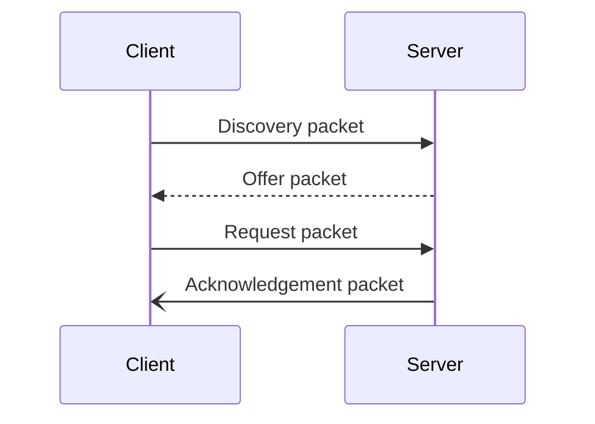

---
aliases:
  - Network Services
tags:
  - Notes
  - Data-Communication-and-Networking
Date: 2023-09-18
Completion: true
obsidianUIMode: preview
---
# Dynamic Host Configuration Protocol

## Discovery packet
When a **new device** is connected to a network, it broadcasts DHCP discovery packet to all the connected devices in the local subnet. The DHCP discovery packet contains the request for configuration parameters.
**Source IP:** 0.0.0.0
**Destination IP:** 255.255.255.255
## Offer packet
The DHCP server receives the DHCP discovery packet and replies with a DHCP offer packet that contains the ip address and other parameters to the client.
**Source IP:** 1.1.1.1
**Destination IP:** 255.255.255.255
## Request packet
The DHCP server receives the DHCP offer packet and sends a DHCP request packet, requesting the ip address and other parameters to be assigned to it. 
**Source IP:** 0.0.0.0
**Destination IP:** 255.255.255.255
## Acknowledge packet
The DHCP server receives the request packet and sends a DHCP acknowledge packet, confirming the assignment of the ip address and other configurations to the client device. 
**Source IP:** 1.1.1.1
**Destination IP:** 255.255.255.255
# Domain Name Service - DNS
>[!NOTE] Function
>Translate URL to ip addresses

**Order**: Recursive -> Root DNS -> Top Level Domain -> Authoritative DNS -> Recursive -> Client

## STAGES
| Name              | Function                                           |
| ----------------- | -------------------------------------------------- |
| Recursive DNS     | Accepts DNS queries, replies with cached record    |
| Root DNS          | Contains the location of Top Level Domain          |
| Top Level Domain  | Contains location of the authoritative DNS         |
| Authoritative DNS | Contains the IP address of the URL being looked up |

- [!] Only when the ip address is not in recursive DNS, will root DNS be used. 
- [!] DNS Poisoning
	- Users pretend to be the DNS server

# TELNET & SSH
Remote login is user access a remote system. Typically over a network connection. A user logins to the remote system using username and password which then allows user to access resources and perform tasks. 

## Telnet

When using telnet, a user accesses a remote system using a Telnet client program which allows the user input commands and receive outputs through the client program. By inserting username and password, the user can perform tasks and access the resources as if they are there

## SSH
Pretty much the same as telnet but it is more secure. It establishes a secure connection between the client and the remote system. The user has to be authenticated with username and password with public or private key. This is preferred over other insecure remote shells

## Differences between SSH and Telnet
| SSH                           | TELNET                                                                       |
| ----------------------------- | ---------------------------------------------------------------------------- |
| IT is more secure             | IT is less secure                                                            |
| It transfers encrypted data   | Transfers data in the form of plaintext                                      |
| Can be used in public network | Not suitable in public network                                               |
| Full name is Secure Shell                              | Full name is Telecommunication and Networks. Designed for Local area Network |

# TCP and UDP
| TCP                                                             | UDP                                        |
| --------------------------------------------------------------- | ------------------------------------------ |
| It is slower than UDP                                           | It is faster than TCP                      |
| It can guarantee the delivery of data to the destination router | It cannot guarantee the delivery of data to the destination router   |
| It has extensive error checking and acknowledgement of data     | It has basic error checking using checksum |
| Does not support broadcast                                      | Supports braodcast                         |

# Chapter 5 - Routing
[[Chapter 5 - Routing]]