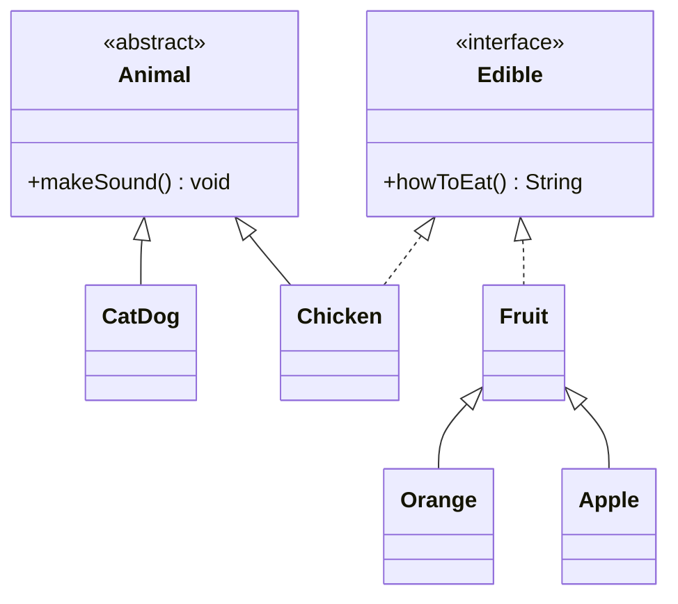

---
aliases:
  - Abstract
  - Interface
tags:
  - Notes
  - OOP
Date: 2023-09-18
Completion: true
obsidianUIMode: preview
---
## Abstract classes
>[!DEFINITION] Concrete Classes
>Classes that can be instantiated into objects are called concrete classes

>[!DEFINITION] Abstract classes
>Classes that cannot be instantiated into objects are called abstract classes. This is usually used to define the general characteristics of classes.

**Rules for abstract classes**
1. It cannot be instantiated
2. It can have abstract and non abstract methods
3. Can have final methods
4. Can have constructor and static methods also

*So, what is the difference between abstraction and encapsulation*

| Abstraction                                                          | **Encapsulation**                                                            |
| -------------------------------------------------------------------- | ---------------------------------------------------------------------------- |
| Solves the problem at the design level                               | Solves the problem at the implementation level                               |
| Allows users to only see what the class does and not how it is done. | Prevents certain classes from accessing variables/methods from another class |
| Hiding unwanted details from the user                                | Hiding data variables and methods between classes.                           |
Take this for example,
```java
public class Animal{
	public void showSpecies(){
		System.out.println("I'm a common animal");
	}
	public void makeSound(){
		System.out.println("Meeeeeek");
	}
}
```
Since animal is an incredibly general term, there will be a lot of classes that inherit from this class and each will have its own implementation. So, defining the methods in the `Animal` class seems pointless as all of it will be overridden anyway. Additionally, since an `Animal` object doesn't really mean much, creating an `Animal` object is also pointless.

If the `Animal` is not defined with `abstract` keyword, the implementation has to exist. A better way to define animal class is like this

```java
public abstract class Animal{
	public abstract void showSpecies();
	public abstract void makeSound();
}
```

```java
public class Dog extends Animal{
	public void showSpecies(){
		System.out.println("I am a dog!");
	}
}
```

By making the `Animal` an abstract class and the methods abstract, we don't have to provide an implementation of the methods - saving both time and memory.

However, since abstract classes cannot instantiated their own objects,
```java
Animal animal = new Animal();
```
This is illegal and will produce a compilation error. (**Abstract classes only define generic characteristics/behaviour**). 

It is also possible to define `non-abstract` method in a `abstract` class.

```java
public abstract class Animal{
	public abstract void showSpecies();
	public abstract void makeSound();
	public void eat(){
		System.out.println("I am grazing grass");
	}
}
```
You do this when you believe that most of the inherited class will share this same implementation. 

You can't use `abstract` classes to instantiate a new object, but you can use `abstract` classes as datatypes.

```java
Animal ani = new Animal(); // this is illegal
Animal ani2 = new Dog(); 
```
In the second line, I am creating a `dog` object which is an animal. 

*How about when I create an array?*
You are also allowed to do that
```java
Animal aniList = new Animal[SIZE];
aniList[0] = new Animal // this is wrong 
```
*Since I can't instantiate from an `abstract` class, what's the point of constructors?*
Well, recall that subclasses will invoke the `super()` whenever it uses its own constructor. The `abstract` class constructor can be called upon by the `subclass` 

>[!TLDR] Abstract classes
>It's classes that cannot be used to create object

## Interface
In Java, multiple inheritance is not possible. That's why `interface` class is introduced. 

**Rules**
1. Cannot be used to create objects
2. Methods defined are `public` and `abstract` by default
	1. There are no implementation of the methods
3. Attributes are `static`, `public`, and `final` by default.
4. Any method defined in the `interface` class must be overridden by the class that `implements` it. 
Just like `abstract` classes, `interface` can be used as datatypes.



- *dashed line means implement, abstract and interfaces are meant to be written in italic*

In this case, fruit and chicken are unrelated, but they still share a common method, `howToEat()`, so they can implement from the same interface. 

Just like `abstract` classes, `interface` cannot instantiate objects, but you can use it as datatypes. 

```java
Edible edibleObj = new Edible(); // error
Edible edibleObj = new Chicken(); // this is fine
if (edibleObj instanceof Edible); // this is fine
```
>[!INFO] Multiple inheritance
>Java does not allow multiple inheritance to avoid the *diamond problem*. This happens when two superclass posses the same methods with the same signature and return type.

*Can I implemented multiple interface*
Yes, you can do it via multiple inheritance. 

Since all data fields are `public`, `static`, and `final` by default and all methods are `public` and `abstract` by default, these keywords can be ommitted.

```java
public interface T1{
	public static final int k = 1;
	public abstract void p();
}

public interface T1{
	int k =1; 
	void p();
}
```

>[!TLDR] Interface
>Use interface when you want to implement multiple inheritance. 

## So, `abstract` vs `interface` 

**Differences**

|                    | Data fields                            | Constructors                           | Methods                                                                                      |
| ------------------ | -------------------------------------- | -------------------------------------- | -------------------------------------------------------------------------------------------- |
| **Abstract class** | No restrictions                        | Constructors are invoked by subclasses | Can have `abstract`, `non-abstract`, `final`, `static` methods<br>Can contain implementation |
| **Interface**      | All variables are `static` and `final` | Cannot implement a constructor         | Only `public` and `abstract`<br>Cannot contain any implementation                            |

**When should we use either one?**
1. Use abstract class when a template is needed for multiple subclasses
2. Use interface when multiple unrelated classes require the same methods/attributes