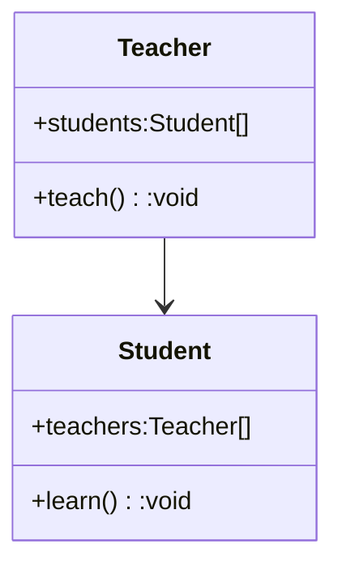
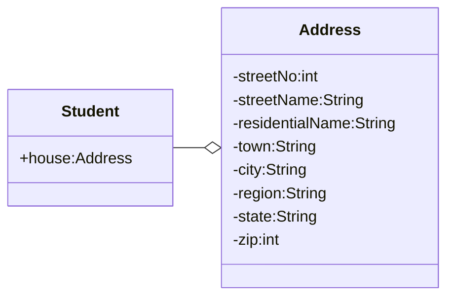
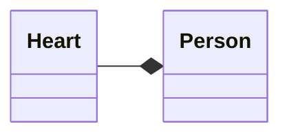
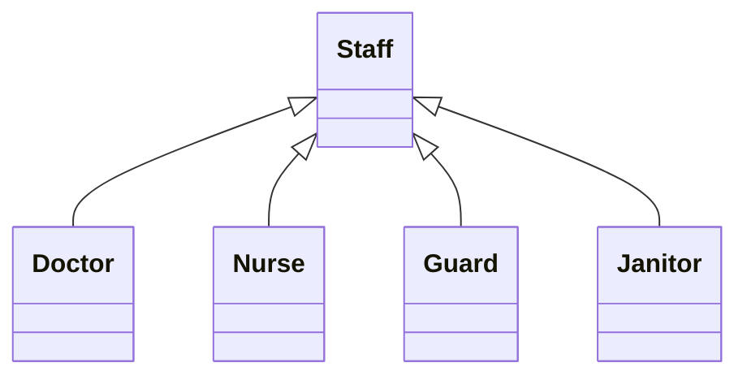
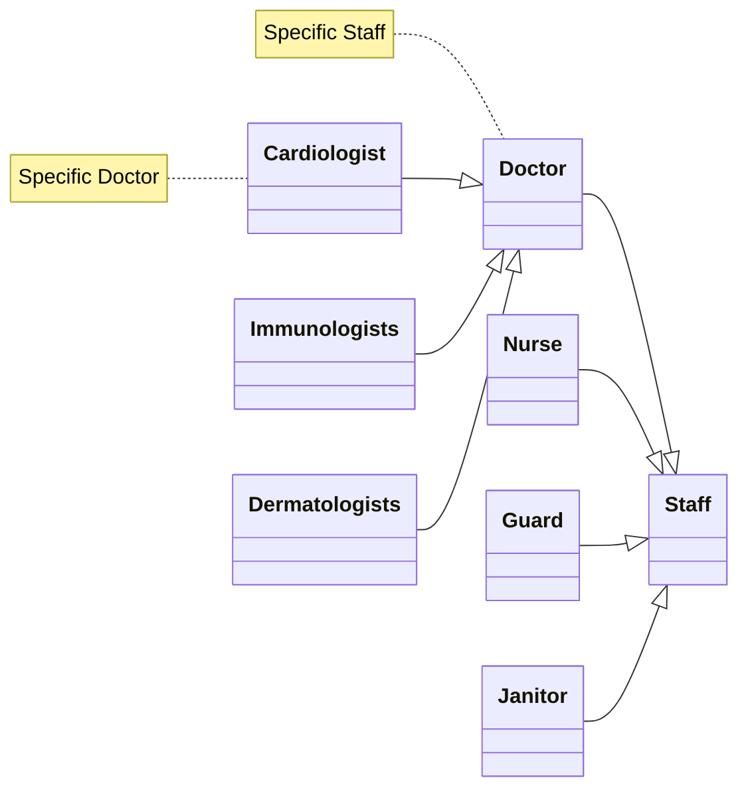
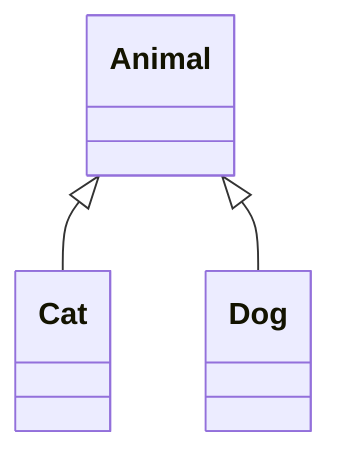

---
aliases:
  - Class relationship
tags:
  - Notes
  - OOP
Date: 2023-09-18
Completion: true
obsidianUIMode: preview
---
# Association
>[!DEFINITION] Association
>It is the relationship between two objects

Refers to how objects are related to each other and how they are using each other's functionality and services provided by another object.

Associations can be:
1. one-to-one
2. one-to-many
3. many-to-many


The symbol used can be -- or -->

Association is often times used to represent general interactions between classes. More specific forms of interactions are:
1. Aggregation
2. Composition
3. Inheritance

Usually, in aggregation and composition, the relationships are represented as a data field in the [[Class Relationships#^ca0b9f|aggregating]] object.
## Aggregation
>[!DEFINITION] Aggregation
>It is a weak form of relationship. The relationship between two objects with aggregation can be seen as *has-a* relationship

>[!WARNING] Aggregate
>Aggregation and Aggregate are different!

In aggregation, the objects involved have separate lifespans. 

For example, a `Student` *has an* `Address`. In this example, the `Student` and the `Address` has separate lifespans, meaning if the `Student` moves to a new `Address`, it does not mean the older `Address` will be gone. The same applies in the other direction, if the `Address` is gone, the `Student` simply finds a new `Address`; the `Student` does not die or perish. The `Address` may have also existed prior to the `Arrival` of the student

Another characteristics that you may notice is that the relationship is unidirectional. A student has an address but an address does not have a student (*it does't make sense!*)


In aggregation, the owner object is called the *aggregating* object while the subject object is called the *aggregated* object.  ^ca0b9f

## Composition
>[!DEFINITION] Composition
>It is a strong form of relationship. The relationship between two objects with aggregation can be seen as *part-of* relationship

In composition, the objects involved have similar lifespan as one cannot exist without the other. Additionally, just like aggregation, the relationship between the two object is unidirectional.

For example, the relationship between a `Person` and a `Human Heart` is 
a composition relationship. A `Person` cannot live without a `Human Heart` and a `Human Heart` cannot exist without a `Person`. If the person were to perish, the `Human Heart` goes along with the `Person`. \


The symbol used is --<> *(filled diamond head)*

# Inheritance

^f45757

>[!DEFINITION] Inheritance
>This form of relationship uses a *is-a* relationship. 
>>[!EXAMPLE] Inheritance
>>A `Grasshopper` *is-a* `Insect`

Inheritance is one of the pillars in OOP. This relationship allows objects to inherit characteristics from other **similar** objects, reducing repeated codes and improve readability. 


The UML diagram shows that `Doctor`, `Nurse`, `Guard`, and `Janitor` are similar in a sense that they are all `Staff`. Since `Doctor`, `Nurse`, `Guard`, and `Janitor` would have `id` data field, with `Staff` object, you do not have to repeat the `id` code in those 4 classes. 

You can imagine the UML diagram for inheritance as a tree diagram with its node becoming more and more niche as the tree grows its roots.


As you can see from the *horizontal* tree, as the tree grows its roots, the nodes become more specific, with the leaves as the niches. 

A `Cardiologist` *is-a* `Doctor` and a `Doctor` *is-a* `Staff`. 

We call the `Staff` the **parent** class or the **superclass** and the `Doctor` as the **child** class or the **subclass**. When an object inherits another object, the inheriting object inherits all the `public` attributes and methods except the constructors of the inherited object.

In Java, the keyword `extends` is used. 
```java
public class Doctor extends Staff{
	public Doctor(){} // default constructor
}
```
The `Doctor` class can override the methods of the `Staff` class. This is known as `overriding`.

```java
public class Staff{
	public void walk(){
		System.out.println("Where am I walking to?");
	}
}
public class Doctor extends Staff{
	@Override
	public void walk(){
		System.out.println("I am walking to my patient");
	}
}
public class Main{
	public static void main(String[] args){
		Doctor doc = new Doctor();
		Staff staff = new Staff();
		
		staff.walk(); // Prints "Where am I walking to?"
		doc.walk(); // Prints "I am walking to my patient"
	}
}
```

As mentioned earlier, the **subclass** will only inherit the `public` attributes and methods. Anything marked with `private` cannot be inherited.
```java
public class Staff{
	public void walk(){
		System.out.println("Where am I walking to?");
	}
	private int id;
}
public class Doctor extends Staff{
	@Override
	public void walk(){
		System.out.println("I am walking to my patient");
	}
	// does not inherit id attribute directly
}
public class Main{
	public static void main(String[] args){
		Doctor doc = new Doctor();
		Staff staff = new Staff();
		
		staff.walk(); // Prints "Where am I walking to?"
		doc.walk(); // Prints "I am walking to my patient"
	}
}
```
*But, `id` cannot be inherited, what's the point?*

Recall that constructors cannot be inherited, but they can be called with the keyword `super()`. However, there are some rules:
1. A `default constructor` must exist in the **parent** class
	- If the **parent** class has custom constructors, you must explicitly define a `default constructor`
	- A `super()` will be inserted by default by the compiler
2. A constructor with the same number of parameters as the number of arguments passed in the `super()` must match.

```java
public class Staff{
	public Staff(){}
	public Staff(int id, String name){
		this.id = id;
		this.name - name;
	}
	public void walk(){
		System.out.println("Where am I walking to?");
	}
	public int getID(){return id;}
	public int getName(){return name;}
	private int id;
	private String name;
}
public class Doctor extends Staff{
	public Doctor(){
		// explicitly calling the superclass constructor
		super(1, "Spongebob");
	}
	@Override
	public void walk(){
		System.out.println("I am walking to my patient");
	}
}
public class Main{
	public static void main(String[] args){
		Doctor doc = new Doctor(); // calls the Doctor default constructor
		Staff staff = new Staff();
		
		// calls the staff getID function
		System.out.printf("The doctor's id is %d", doc.getID());
	}
}
```

A superclass can also reference a subclass, but a subclass cannot reference a superclass. ^ad4a74

```java
Staff doc = new Doctor(); // this is fine
Doctor staff = new Staff(); // error
```

You can think of this as a `Doctor` which is a `Staff`. 
## Casting objects
An object can also be converted into another object - **upcasting** and **downcasting** - **within a inheritance hierarchy.

```java
testMethod(new Dog());
testMethod(new Cat());
public testMethod(Animal ani){
	ani.makeNoise();
	Dog dog = (Dog) ani;
	dog.bark();
}
```

When `testMethod(new Dog())` and `testMethod(new Cat())` is called, the object is **upcasted** into `Animal` type. In the method, when `ani.makeNoise()` is called, the generic method is called. In the line `Dog dog = (Dog) ani`, the object is **downcasted** into a `Dog` object. However, when `Cat` is passed to the method, an error occurs. <br>*Why is that?*

Well, this is because casting cannot be done between siblings in the inheritance hierarchy. 

In this case, the conversion between `Cat` and `Dog` is not possible

## Checking Specific class
*So, how do you fix the error above?*<br>We have to tweak the method signature and add an `if` statement to it
```java
testMethod(new Dog());
testMethod(new Cat());
public testMethod(Object obj){
	if(obj instanceof Dog){}
		Dog dog = (Dog) ani;
		dog.bark();
	}
	else
		Cat cat = (Cat) ani;
		cat.meow();
}
```

*Oh, look! A new keyword!* `instanceof` checks for the specific class of the object.


# Polymorphism
`private` methods cannot be overridden by the subclass because they are not accessible outside of the class itself. `Static` methods cannot be overridden as well, but they can be inherited.

*So, what's the difference between overriding and overloading?*


| **Overriding**                                            | **Overloading**                                                                                                            |
| --------------------------------------------------------- | -------------------------------------------------------------------------------------------------------------------------- |
| The return type and the method signature must be the same | The name must be the same, but the parameters and return can be different.<br>Changing only the return type is not enough. |
| It's just the content that is different                   | The content is the same.                                                                                                   |
```java
public class Staff{
	public void walk(){
		System.out.println("Where am I walking to?");
	}
}
public class Doctor extends Staff{
	@Override
	public void walk(){
		System.out.println("I am walking to my patient");
	}
	public void eat(){
		System.out.println("Only doctors eat I guess");
	}
}
public class Main{
	public static void main(String[] args){
		Doctor doc = new Doctor();
		Staff staff = new Staff();
		
		staff.walk(); // Prints "Where am I walking to?"
		doc.walk(); // Prints "I am walking to my patient"
	}
}
```

Polymorphism can only take place in an inheritance relationship.

>[!WARNING] Keep this in mind
>The rest of this section references this [[Class Relationships#^ad4a74|click me!]]

However, when referencing in such as way, keep in mind that the object created can only access the methods and attributes in the superclass used as the datatype. 
```java
doc.eat(); // this will result in error
```

If both `Doctor` and `Staff` contain the same methods, the contents of the overridden methods takes priority. 
```java
public class Staff{
	public void walk(){
		System.out.println("Where am I walking to?");
	}
	public void eat(){
		System.out.println("Nom nom");
	}
}
public class Doctor extends Staff{
	@Override
	public void walk(){
		System.out.println("I am walking to my patient");
	}
	@Override
	public void eat(){
		System.out.println("Only doctors eat I guess");
	}
}
public class Main{
	public static void main(String[] args){
		Doctor doc = new Doctor();
		Staff staff = new Staff();
		
		staff.walk(); // Prints "Where am I walking to?"
		doc.walk(); // Prints "I am walking to my patient"
	}
}
```

```java
doc.eat(); // Only doctors eat I guess
```


# See next
[[GUI Programming]]