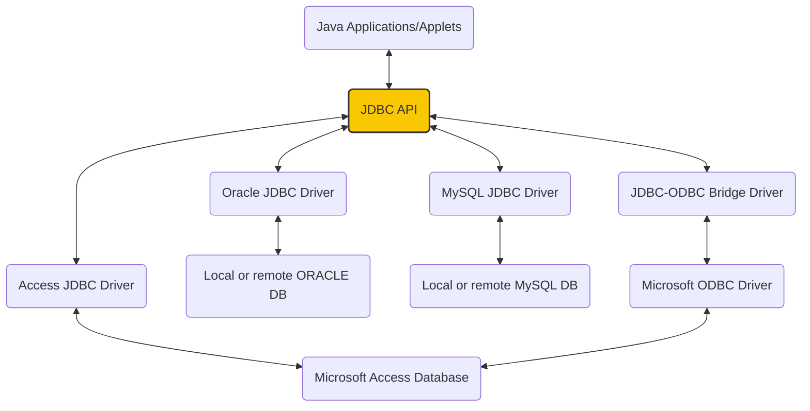
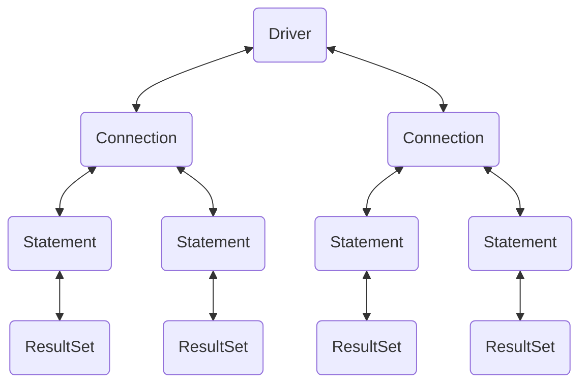

---
aliases:
  - DBMS
tags:
  - Notes
  - Java
Date: 2023-09-18
Completion: true
obsidianUIMode: preview
---
>[!WARNING]
>This chapter does not touch SQL commands and how to write them!
>This chapter uses the dataset from this website
>[SQL to Pandas converter](https://sql2pandas.pythonanywhere.com/)

Java also lets you connect to a database and control it remotely. The Java API for developing Java Database application is called JDBC.

*Architecture of JDBC*


*JDBC interface*


# Loading and Establishing connection
Before connecting to a database, you have to load the driver for the database system.

```java
Class.forName("JDBCDriverClass")
```

**Driver class examples**

| Database | -   | Driver Class                    | Source                        |
| -------- | --- | ------------------------------- | ----------------------------- |
| Access   | -   | sun.jdbc.odbc.JdbcOdbcDriver    | Already in JDK (1.7 or below) |
| MySQL    | -   | com.mysql.jdbc.driver           | Website                       |
| Oracle   | -   | oracle.jdbc.driver.OracleDriver | Website                       |
>[!FYI]
>Starting JDBC4.0, drivers in the build path are automatically loaded

Since JDK 1.8 and onwards no longer support JDBC-ODBC Bridge, it is **mandatory** to connect Java application and Access databases **without** ODBC. 
## Establishing connection
To establish a connection, the following code is required,
```java
Conection conn = new DriverManager.getConnection(databaseURL)
```

*Snippet A: Establishing connection*
```java
// JDK 1.7 and below
Connection connAccess = DriverManager.getConnection("jdbc:odbc:TheSourceOfTheDatabase");

// JDK 1.8 and onwards
Connect connAccess = DriverManager.getConnection("jdbc:ucasnaccess://Address");

Connection connMySQL = DriverManager.getConection("jdbc:mysql://localhost/test");
Connection connOracle = DriverManager.getConnection("jdbc:oracle:thin:@liang.armstrong.edu:1521:orcl", "scott", "tt1234"});
```

>[!WARNING] Access 
>The rest of this chapter will use Access

# Creating and executing statements
To run an SQL statement in Java, you have to use `createStatement()` method.
```java
Statement statement = connAccess.createStatement();
```

To perform any update, insert, and removal of data, `executeUpdate()` statement will be used, but to perform any query, `executeQuery()` will be used.

*Snippet B: Student Table*
```java
statement.executeQuery("CREATE TABLE Student
					   (
					   id int(5), 
					   name varchar(50),
					   age int(2),
					   gender varchar(1),
					   primary key (id)
					   )
					   ");
statement.executeUpdate("INSERT INTO Student VALUES(1, 'Jimmy Ding', 20, 'M', )");
statement.executeUpdatE("UPDATE Student SET name = 'Jimmy' where id = 1");
```

Notice how the *;* is outside the SQL statement. 

When using a query statement, the result is stored to a variable of `ResultSet` type.
The query result is returned with a *row-by-row* basis. To display them, we would have to use a `while` loop with `.next()` statement combined. This is combined with a `for` loop to travel through each column.

>[!TLDR] Looping
>`while` $==$ row
>`for` $==$ column

```java
ResultSet rs = statement.executeQuery("SELECT * FROM Student");
int noColumn = 4;
while (rs.next()){
	// index starts at tone
	for (int index = 1; index <= noColumn; index++)
		System.out.println(rs.getString(i) + "\t");
}
```

# Statement templates
The `Statement` interface is used to execute **static** SQL statement, meaning that you have to keep write statements one by one (*potentially repeating a lot of code*). Since we're lazy (*you should be!*), you can use `prepareStatement()` instead. 

```java
PreparedStatement presStatement = connAccess.prepareStatement("INSERT INTO STUDENT (id, name, age, gender) values(?, ?, ?, ?)");

preStatement.setInt(1, 2);
preStatement.setSting(2, "Jolyn");
preStatement.setInt(3, 20);
preStatement.setString(4, "F");

preStatement.executeUpdate()
```

The set method follows this format, `set<Type>(<index>, <value>)`.

# Metadata
JDBC also provides the `DatabaseMetaData` interface for obtaining information regarding the database itself. `ResultSetMetaData` interface is used for obtaining information on the specific `ResultSet` such as column count and column name.

*Snippet C: Database Metadata*
```java
DatabaseMetaData dbMetaData = connAccess.getMetaData();
System.out.println("Database URL" + dbMetaData.getURL());
System.out.println("Database username" + dbMetaData.getUsername());
```

*Snippet D: Result Set Meta Data*
```java
ResultSet rs = statement.executeQuery("SELECT * FROM STUDENT");
ResultSetMetaData rsMD = rs.getMetaData();
for (int index = 1; index <= rsMd.getColumnCount(); index++)
	System.out.println(rsMD.getColumnName(index) + "\t");
while(rs.next()){
	for (int index = 1; index < rsMD.getColumnCount(); index++)
		System.out.printf("%s\t%n", rs.getObject(index));
}
connAccess.close();
```

>[!WARNING] Close connections

**More will be added in the future**


