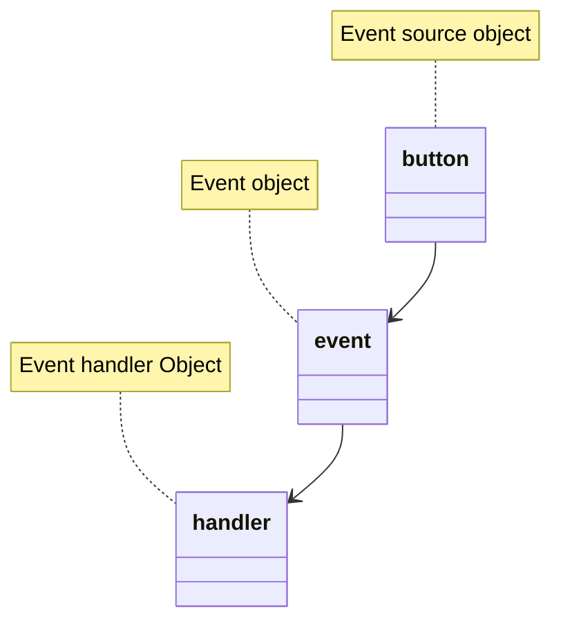

---
aliases:
  - JAVA GUI
tags:
  - Notes
  - Java
  - GUI
Date: 2024-09-14
Completion: false
obsidianUIMode: preview
---
*Hey congratulations, you have completed the basics of JAVA. But, you may have noticed that your applications are displayed in console which is boring.* 

So, this chapter is dedicated to learning GUI programming using JavaFX library.

# Basic structure of a JavaFX program
*Snippet A: Basic JavaFX program*
```java
import javafx.application.Application;
import javafx.scene.Scene;
import javafx.stage.Stage;
import javafx.scene.control.Button;


public class Main extends Application
	@Override
	public void start(Stage primaryStage){
		Button okBtn = new Button("Ok"); // creates a button
		Scene scene = new Scene(okBtn, 200,200); // Creates a scene and adds the button to it
		
		primaryStage.setScene(scene);
		primaryStage.setTitle("OK button");
		primaryStage.show();
		
	}
	public static void main(String[] args){
		launch(args); // required to launch the JavaFX program
	}
```

To create a JavaFX application, the `Main` class has to be extended with `Application` class and `start` class **must** be overridden. 
## Components of an Application
1. `Stage`
	- The `Stage` object is the window of the application. It contains all of a JavaFX application. A `Stage` object called the `primaryStage` is created automatically by the JVM on launch.
2. `Scene`
	- A `Scene` object is the object that houses the contents of a JavaFX application
3. `Node`
	- A `Node` is an element inside the `Scene`.
	- It is the interactive parts of the JavaFX application 

![[javafx_components|700]]

It is also possible to create multiple stages.

*Snippet B: Multiple stages*
```java
import javafx.application.Application;
import javafx.scene.Scene;
import javafx.stage.Stage;

public class Main extends Application{
	@Override
	public void start(Stage primaryStage){
		Button okBtn = new Button("Ok"); // creates a button
		Scene scene = new Scene(okBtn, 200,200); // Creates a scene and adds the button to it
		
		primaryStage.setScene(scene);
		primaryStage.setTitle("Stage1");
		primaryStage.show();
		
		// creates another stage
		Stage stage2 = new Stage();
		stage2.setScene(new Scene(new Button("New scene"),200,200));
		stage2.setTitle("Stage2");
		stage2.show();
	}
	public static void main(String[] args){
		launch(args);
	}
}
```
# Building an application
In the examples shown, the `Scene` constructor takes one `Node` at a time. But, what if you wish to have multiple nodes? To achieve that, we would have to use `Pane`s.

>[!DEFINITION] Panes
>A pane is a container class meant to hold nodes in a desired location and size. 

There are 9 panes in JavaFX:
1. Pane
	- The base class for layout panes
2. StackPane
	- Places the nodes on top of each other in the centre of the pane
3. FlowPane
	- Places the nodes row-by-row horizontally or column-by-column vertically
	- A new row or column is created automatically when the total length of the nodes reaches the end of the row or column
4. GridPane
	- Places the nodes in cells in a 2D grid 
5. BorderPane
	- Places the nodes in top, right, left, bottom, or center regions
6. HBox
	- Places the nodes in a single row
7. VBox
	- Places the nodes in a single column
8. TilePane
	- Places the nodes in the form of uniformly sized tiles.
9. AnchorPane
	- Anchors the nodes in our application at a particular distance from the pane.

*Snippet C: Pane in action*
```java
import javafx.application.Application
import javafx.scene.Scene;
import javafx.scene.layout.StackPane;
import javafx.stage.Stage;

public class Main extends Application{
	@Override
	public void start(Stage primaryStage){
		StackPane pane = new StackPane();
		pane.getChildren.add(new Button("OK"));
		primaryStage.setScene();
		primaryStage.setTitle();
		primaryStage.show();
	}
	
	public static void main(String[] args){
		launch(args);
	}
}
```

In the code above, `getChildren()` is used to return the list for holding nodes in the pane. The `add(node)` is then used to add the node in. 

>[!QUESTION] *So, if I have multiple nodes, does that mean I have to add or remove one by one?*
>No. You can use `addAll(node, node,...)`, and `removeAll(node,node,...)` to add multiple nodes in the same line.

## BorderPane
## GridPane
## FlowPane
## HBox
## VBox
# JavaFX Styling
JavaFX offers a way to stylise the nodes in the application. The JavaFX style properties are similar to CSS (*yes, the one used in web dev*), called JavaFX CSS.

The format of the code is as follows:
```java
node.setStyle("-fx-property:value");

circle.setStyle("-fx-stroke: black; -fx-fill:red");
hBox.setStyle("-fx-background-color:gold");
```

When multiple styles are applied ';' is used to separate them.
# Shapes
JavaFX also provides classes to draw:
1. lines
2. circles
3. rectangles
4. ellipses
5. arcs
6. polygons
7. polylines

JavaFX also provides a class for you to customise your texts.

The `Shape` class is an abstract class that defines the common properties for all shapes. There are some common methods amongst them, such as:
1. `setFill`
2. `setStroke`
3. `setStrokeWidth`

You can achieve the styling with the methods above or by [[GUI Programming#JavaFX Styling|JavaFX CSS]].
## Text
### Font
## Line
## Circle
## Rectangle
## Ellipse
## Arc
# Events
*I have created the UI for the application but it does not do anything; the buttons don't work, the text does not drag, and the shapes don't interact. How do I fix that?*


>[!DEFINITION] Events
>A type of signal to the program that something has happened. It is an object created from an *event source*

To respond to an event/interaction, a connection between the event source object and the object that capable of handling the event has to be established.



There are a lot of events defined in JavaFX such as `ActionEvent`, `MouseEvent`, `KeyEvent` to name a few. You can also find the event source object with `getSourceMethod()`.

To handle a specific type of event, two things are required:
1. The event handler (listener) object must implement the `EventHandler<XEvent>` interface.
	- This interface contains the `handle(XEvent e)` methods to process the event
2. The handler object must be registered with the event source object using `source.setOnXEventType(listener)`

*Snippet  : Event Handling*
```java
// MouseEvent/KeyEvent can be defined as well
class btnClick implements EventHandler<ActionEvent>{
	public void handle(ActionEvent e){
		System.out.println("OK button clicked");
	}
}

btnClick btnEvent = new btnClick();
Button okBtn = new Button("OK");
okBtn.setOnAction(btnEvent);
```

*There are so many types of events, how do I remember them?*<br>You don't. The names of the methods are largely similar. For example,

|    **Action**    | **Source Object** | **Event Type** | **Event Registration Method**                  |
| :--------------: | :---------------: | :------------: | :--------------------------------------------- |
|  Click a Button  |      Button       |  ActionEvent   | setOnAction(EventHandler \<ActionEvent>)       |
|  Pressing Enter  |     TextField     |       ^        | ^                                              |
| Check or uncheck |    RadioButton    |       ^        | ^                                              |
|        ^         |    CheckButton    |       ^        | ^                                              |
| Select new items |     ComboBox      |       ^        | ^                                              |
|  Mouse pressed   |    Node, Scene    |   MouseEvent   | setOnMousePressed(EventHandler \<MouseEvent>)  |
|  Mouse released  |         ^         |       ^        | setOnMouseReleased(EventHandler \<MouseEvent>) |
|  Mouse clicked   |         ^         |       ^        | setOnMouseClicked(EventHandler \<MouseEvent>)  |
|   Mouse enterd   |         ^         |       ^        | setOnMouseEntered(EventHandler \<MouseEvent>)  |
|   Mouse exited   |         ^         |       ^        | setOnMouseExited(EventHandler \<MouseEvent>)   |
|  Mouse dragged   |         ^         |       ^        | setOnMouseDragged(EventHandler \<MouseEvent>)  |
|   Mouse moved    |         ^         |       ^        | setOnMouseMoved(EventHandler \<MouseEvent>)    |
|    Key presed    |         ^         |    KeyEvent    | setOnKeyPressed(EventHandler \<KeyEvent>)      |
|   Key released   |         ^         |       ^        | setOnKeyReleased(EventHandler \<KeyEvent>)     |
|    Key typed     |         ^         |       ^        | setOnKeyTyped(EventHandler \<KeyEvent>)        |
Notice how every method starts with *setOn* and followed up with the action. 

## Inner Class
A handler class is designed specifically to create a handler object for a GUI component. Since it will not be shared by other applications, it is better to define the handler class inside the `main` class as an `inner class`.

>[!DEFINITION] Inner class
>A class defined within the scope of another class. 

An inner class can directly reference the data and methods defined in the outer class it is nested in. 

*Snippet : A more complete version*
```java
import java.application.Application;
import java.scene.Scene;
import java.stage.Stage;

import java.scene.layout.StackPane;

public class Main extends Application{
	@Override
	public void start(Stage primaryStage){
		btnClick btnEvent = new btnClick();
		Button okBtn = new Button("OK");
		okBtn.setOnAction(btnEvent);
		
		StackPane pane = new StackPane();
		pane.getChildren().add(okBtn);
		
		Scene scene = new Scene(pane, 200,200);
		primaryStage.setScene(scene);
		primaryStage.setTitle("Button");
		primaryStage.show();
	}
	public static void main(String[] args){
		launch(args);
	}
	// This is an inner class
	class btnClick implements EventHandler<ActionEvent>{
		public void handle(ActionEvent e){
			System.out.println("Hey you clicked on me!");
		}
	}
}
```

You can also add multiple events in the event handler method with `getSource()` method. This is useful when you have multiple nods of the same type but will have different interactions when clicked, reducing repeated code.

*Snippet  : Multiple events*
```java
import java.application.Application;
import java.scene.Scene;
import java.stage.Stage;

import java.scene.layout.StackPane;

public class Main extends Application{
	@Override
	public void start(Stage primaryStage){
		
		btnClick btnEvent = new btnClick();
		
		Button okBtn = new Button("OK");
		Button notOkBtn = new Button("Not OK");
		
		// Calling the same event handler
		okBtn.setOnAction(btnEvent);
		notOkBtn.setOnAction(btnEvent);
		
		StackPane pane = new StackPane();
		pane.getChildren().add(okBtn);
		
		Scene scene = new Scene(pane, 200,200);
		primaryStage.setScene(scene);
		primaryStage.setTitle("Button");
		primaryStage.show();
	}
	public static void main(String[] args){
		launch(args);
	}
	// This is an inner class
	class btnClick implements EventHandler<ActionEvent>{
		public void handle(ActionEvent e){
			// determine the exact node
			if (e.getSource() == okBtn)
				System.out.println("You are ok!");
			else
				System.out.println("You are not ok!")
		}
	}
}
```

*Do we have to explicitly create a handler object each time?*<br>No, you can also create anonymous inner class handlers.

>[!DEFINITION] Anonymous Inner Class
>Inner classes without names. The process involves combining the definition of an inner class and creating an instance of the class one step.

```java
okBtn.setOnAction(
	new EventHandler<ActionEvent>(){
		public void handle(ActionEvent e){
			System.out.println("You are ok");
		}
	}
)
```

# 
To make it event simpler, lambda function can be applied.
```java
okBtn.setOnAction(e->
				  System.out.println("You are ok!")
				  );
```
# See next 
[[]]