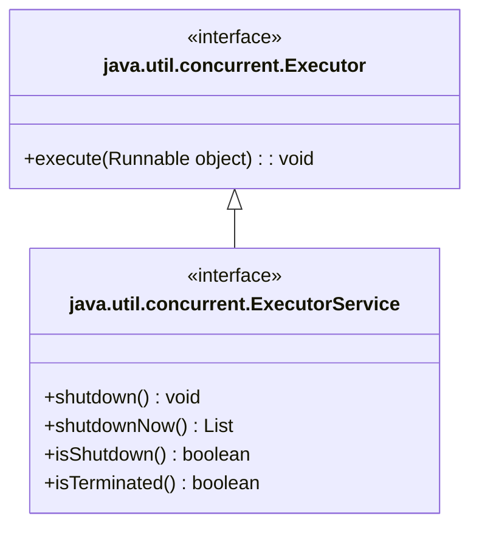
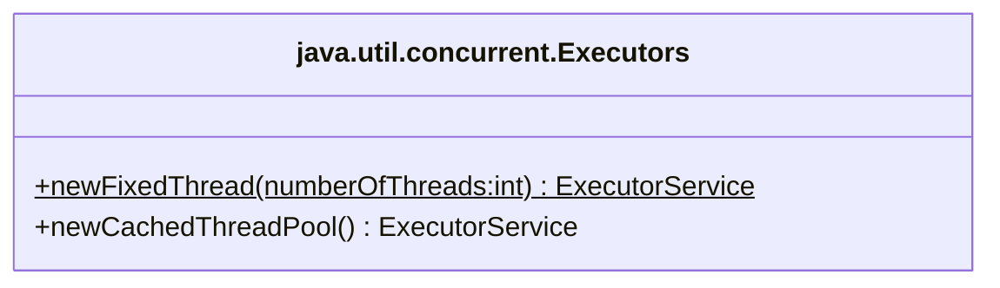

---
aliases:
  - MultiThreading
tags:
  - Notes
  - Java
Date: 2023-09-18
Completion: true
obsidianUIMode: preview
---
Often times, you would find yourself needing multiple functions to run in parallel *but why?*.

Well other than saving time, it is really crucial and convenient.<br>Windows, for example, allows their users to run multiple apps and tasks at the same time. They achieve this via multi-treading. 

A better example would be a stock analytics program. If the program takes a long time to performs its analytics, the notifications users received may arrive too late.
# Definition

In a single-threaded runtime environment, the tasks are executed sequentially, but in multi-threaded runtime environment, multiple tasks can be performed concurrently. 

>[!DEFINITION] Thread
>The flow of execution, from beginning to end, of a task

Java actually provides built-in support for multithreaded programming.

# Multitasking vs Multithreading
>[!DEFINITION] Multitasking 
>Multitasking is a process of executing multiple tasks simultaneously. (*who would have guessed*)

Multitasking can be achieved in two ways:
1. Multiprocessing (*processed-based multitasking*)
2. Multithreading (*thread-based multitasking*)
## Multiprocessing
In multiprocessing, each progress is given an address in memory. As you can guessed, this means that multiprocessing is more resource hungry than multithreading. Switching between different processes takes longer time for saving and loading registers, memory maps, updating lists, and more. The cost of communication between processes is more expensive. 

*If multiprocessing is more resource hungry than multithreading, why do use?*

>[!WARNING] Completion
>Not complete
## Multithreading
Multithreading more lightweight than multiprocessing; the cost of communication is cheaper and the threads share the same address space. 

# Thread Concept
![[threads|700]]

The Java run-time system depends on threads for many things. Threads reduce inefficiency by preventing the waste of CPU cycles.

Threads exist in several states:
1. New
	- When a thread is just created
2. Running
	- When a thread is running
3. Blocked
	- The Java thread is blocked while waiting for resources
4. Suspended
	- The thread is stopped and picks up from where it stopped when resumed
5. Terminated
	- The thread ends and it cannot be resumed anymore
	- The termination happens immediately at any given time
# Applying Threads
Tasks are objects of the task class that implements `Runnable` interface. The `Runnable` interface only has one method to override - `run()`. Tasks must be executed in threads. The `Thread` class contains the constructor for creating thread for a task and many useful methods for controlling threads. The thread will start executing the tasks when `start()` is invoked. When `start()` is invoked, the JVM will execute the task's `run()` method

*Snippet A: Creating tasks*
```java
// Task object
public class TaskClass implements Runnable{
	public TaskClass(){
		// this is the constructor
	}
	public void run(){
		// Tells the system how to run the thread
	}
}

// Driver code
public class Client{
	public void someMethod(){
		
		TaskClass task = new TaskClass();
		Thread thread = new Thread(task);
		thread.start(); // The JVM will invoke the task's run method
	}

}
```

*Snippet B: Task example*
```java
// Create a task object
public class TaskClass implements Runnable{
	public TaskClass(int number){this.number = number;}
	// Tells the system how to run the task
	public void run(){
		while (true){
			System.out.printf("Thread %d", number);
			try{
				Thread.sleep(500);
			}
			catch(Exception e){
				break;
			}
		}
	}
	private int number = 1;
}

public class TestingTask{
	public static void main(String[] args){
		// creates a list of task
		TaskClass[] test = new TaskClass[50];
		// Loops through the list of tasks
		for (int index = 0; index<test.length; index++){
			// adds task into the list
			test[index] = new TaskClass(i);
			// Execute each task
			/*
			Thread thread = new Thread(test[index]);
			thread.start();,,
			*/
			new Thread(test[index]).start();
		}
	}
}
```

In the example above, the statements in `run()` is an infinite loop. If this is a single-threaded program, the loop will never stop and only one loop will executed. However, since this is a multi-threaded program, multiple while loops will be executed. 
## More thread methods
### `sleep(long millisecond)`
This method pauses the thread (*put the thread to sleep*) for a specified amount of time in milliseconds to allow other threads to execute. Raises `InterruptedException`. 
### `yield()` 
Temporarily releases time for other threads
### `setPriority(int arg)`
Set the priority of the current thread. The highest rank is 10 and the lowest rank is 1. The thread with the highest priority will be executed first.

```java
MIN_PRIORITY   // (rank = 1)
NORM_PRIORITY  // (rank = 5)
MAX_PRIORITY   // (rank = 10)
```
### `join()`
Force one thread to wait for another thread to finish. 

>[!WARNING] When to use
>Only use when you need to customise the execution order between thread.

![[join_method|700]]

when `ThreadA.join()` is executed, `ThreadA` is forced to wait until `ThreadB` has completed its execution before continuing.
### `isAlive()` 
As the name suggests, this method checks if the thread is still *alive*; if the thread is in `Ready`, `Running`, `Blocked` and `Suspended` state, `true` will be returned; however, if the thread is in `New` or `Terminated`, `fales` will be returned. 

### `interrupt()`
>[!WARNING] 
>This method is rarely invoked due to its:
>1. Non-forcing behaviour
>2. Complexity of Proper Handling
>3. Inconsistent Behaviour
>4. Alternative approaches

If a thread is `Ready` or `Running`, the interrupt flag of the thread will be set; however, if the thread is in its `Block` state, it will be awakened and enters its ready state and throws `InterruptException`. 

An interrupt is an indication to a thread that it should stop what its doing and do something else.

The interrupt flag can be checked via `isInterrupted()`.

## Depreciated Methods
These methods are unsafe and should be avoided. 
1. `stop()`
2. `suspend()`
	- Use `wait()` or `notify()` instead
3. `resume()`
# Thread Pools
Managing the number of threads running at the same time is essential.

>[!EXAMPLE] 
>You should reserve one thread for controlling. 
>If you have a 4 core 8 threads CPU, limit to 7 threads running concurrently. 

Java provides the `Executor` interface for executing tasks in a thread pool and the `ExecutorService` interface to managing and controlling tasks, allowing you to limit the number of threads running concurrently. 


The `shutdown()` method shuts down the executor but allows the tasks to complete. Once shut down, the executor does not except new tasks, but its sibling, `shutdownNow()` immediately shuts down the executor regardless whether the tasks are completed. 

`isShutDown()` method checks if the executor has been shutdown. `isTerminated()` will return true when all the tasks in the pool are terminated


You can think of the `newFixedThreadPool()` as `static` thread pool while `newCachedThreadPool()` ad `dynamic` thread pool. In `newFixedThreadPool()`, a thread pool with the fixed number number of threads executing concurrently will be created. A thread may be reused to execute another task after its current tasks is finished. In `newCachedThreadPool`, a thread pool that creates new threads as needed, but will reuse previously constructed threads when they are available.

In order to use the executor service, an `Executor` object has to be created with `newFixedThreadPool(int)`. 
```java
ExecutorService executor = Executors.newFixedThreadPool(3);
```

>[!PRACTICE] Thread vs Thread pool
>Use `Thread` class when it is just one task and use thread pool when multiple tasks have to be executed.
# Thread Synchronisation
A **shared resource** can be corrupted with multiple threads access that resource simultaneously. 

![[critical_region|700]]

In the diagram above, both threads accesses the `setRadius` method at the same time to change the value of the radius of the circle. However, since this is running at the same time, the final value of the radius is unclear; it depends on the thread that finishes last. 

This problem - *race condition* - is common in multithreading. When a class causes a *race condition*, the class is said to be not *thread-safe*. As demonstrated with the example above `Circle` is not *thread-safe*.

>[!INFO] Critical region
>The resources that is being accessed by multiple threads concurrently is known as the critical region

*So, how to deal with this?*<br>There are two ways to deal with this:
1. `synchronized`
2. `lock`

## `synchronized`
This keyword, when applied to a method, restricts the method so that only one thread can access it at a time.

```java
public synchronized void setRadius(double amount){
	// class things
}
```

The keyword can also be applied to a portion of a method.

```java
public void setRadius(double amount){
	synchronized(this){
		// code goes here
	}
}
```

When this is applied, if `ThreadB` enters the method after `ThreadA`, `ThreadB`'s access will restricted and will only be able to access it after `ThreadA` has finished. 

![[synchronized|500]]
## `Locks`
A `synchronized` method implicitly acquire lock on the instance before it is executed. If you wish for a more manual control, Java lets you do that via `ReentrantLock` class. 

*Snippet C: `lock()` and `unlock()`*
```java
import java.util.concurrent.locks.Lock;
import java.util.concurrent.locks.ReentrantLock;
public class Circle(){
	ReentrantLock lock = new ReentrantLock();
	public void setRadius(double radius){
		lock.lock();
		this.radius = radius;
		lock.unlock();
	}
	private double radius;
}
```

The code between `lock.lock()` and `lock.unlock()` is the critical region. 


